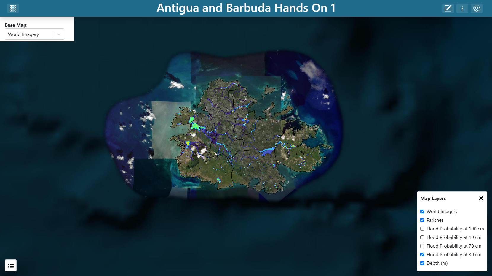
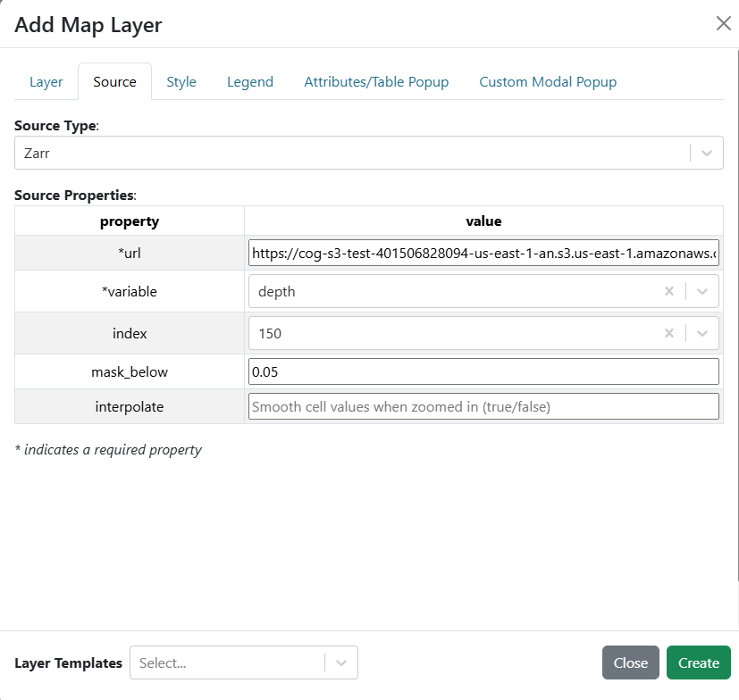
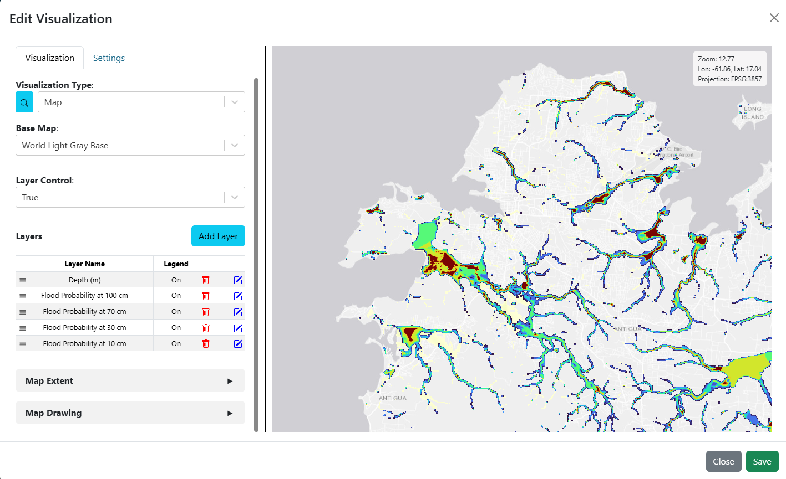
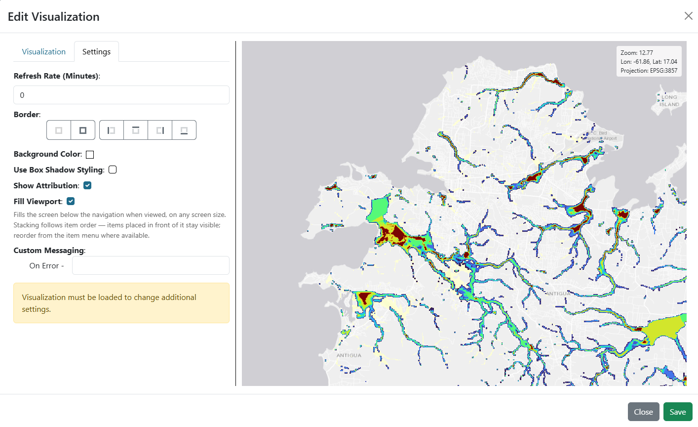

.. Antigua and Barbuda hands-on exercise 1 solution, English.

==============================================================
Exercise 1 — A flood probability map
==============================================================

Building **Antigua and Barbuda Hands On 1 (English)** step by step.

.. contents:: On this page
   :depth: 2
   :local:
   :backlinks: none

What you are building
=====================

One map filling the window, carrying the four exceedance-probability rasters of
the Tropical Storm Jerry forecast, the parish boundaries drawn over them, and a
small dropdown in the top-left corner that switches the base map underneath.

   **Screenshot:** the finished dashboard over satellite imagery, layer control
   open so all five layers are visible, the 30 cm layer drawn.

This exercise is about layers: where a raster URL goes, how a colour ramp is
pinned so four layers can be compared, how a vector outline is styled so it
frames the data without covering it, and which layers to show when the
dashboard first opens.

Step 1 — Create the dashboard
=============================

#. Create a new dashboard (see
   `Creating a dashboard <getting_started_en.rst#creating-a-dashboard>`_) with:

   * **Name**: ``Antigua and Barbuda Hands On 1 (English)``
   * **Description**: ``Solution for WMO Antigua and Barbuda Hands On Exercise #1``

#. Find your dashboard on the landing page and double-click it to open. The
   dashboard is empty, so the preview shows a blank canvas.

#. Open **Dashboard Settings** in the top-right corner, and turn on
   **Unrestricted Grid Item Movement**. Save the settings.

#. Exit **Dashboard Settings** and click **Edit Dashboard** in the top-right
   corner to enter edit mode.

Step 2 — Add the map
====================

#. You will see an existing item on the dashboard. Click on the item's 3-dot
   menu and select **Edit**.

#. Set the **Visualization Type** to **Map** (in the **Default** group).

#. Five arguments appear: **Base Map**, **Layer Control**, **Layers**,
   **Map Extent** and **Map Drawing**. Leave them for now — you will fill them
   over the next steps.

#. In the **Base Map** argument, choose ``World Imagery`` for now. You will
   update this to be dynamic in a later step.

   **Screenshot:** the **Map** visualization's five arguments, with a default
   base map selected.

Step 3 — Add the four probability layers
========================================

These four are identical except for the URL, the name and their initial
visibility, so build one and repeat. Add them in this order, so the deepest
threshold ends up lowest in the stack and the shallowest — which covers the
largest area — ends up on top:

.. list-table::
   :header-rows: 1
   :widths: 30 70

   * - Layer **Name**
     - ``url``
   * - ``Flood Probability at 100 cm``
     - ``https://cog-s3-test-401506828094-us-east-1-an.s3.us-east-1.amazonaws.com/antigua_barbuda_IBF/depth_prob/antiguabarbuda_prob_depth_ge_100cm_overbank.tif``
   * - ``Flood Probability at 70 cm``
     - ``https://cog-s3-test-401506828094-us-east-1-an.s3.us-east-1.amazonaws.com/antigua_barbuda_IBF/depth_prob/antiguabarbuda_prob_depth_ge_70cm_overbank.tif``
   * - ``Flood Probability at 30 cm``
     - ``https://cog-s3-test-401506828094-us-east-1-an.s3.us-east-1.amazonaws.com/antigua_barbuda_IBF/depth_prob/antiguabarbuda_prob_depth_ge_30cm_overbank.tif``
   * - ``Flood Probability at 10 cm``
     - ``https://cog-s3-test-401506828094-us-east-1-an.s3.us-east-1.amazonaws.com/antigua_barbuda_IBF/depth_prob/antiguabarbuda_prob_depth_ge_10cm_overbank.tif``

(More information about the data is in
`The data <getting_started_en.rst#the-data>`_.)

For **each** of the four:

#. Next to **Layers**, click **Add Layer**. The layer editor opens with tabs
   **Layer**, **Source**, **Style**, **Legend**, **Attributes/Table Popup** and
   **Custom Modal Popup**.

#. On the **Layer** tab, set the following properties:

   .. list-table::
      :header-rows: 1
      :widths: 30 70

      * - Field
        - Value
      * - ``name``
        - *see the table above*
      * - **Default Visibility**
        - **on** for ``Flood Probability at 30 cm``, **off** for the other three

   Only the 30 cm layer is drawn when the dashboard opens. All four remain in
   the layer control, so a viewer can switch between them, but stacking four
   nested probability surfaces paints the shallow one over the deep ones and
   the result reads as a single blur. 30 cm is the depth the hazard
   classification of exercise 3 treats as *Medium*, which makes it the natural
   one to open on.

#. On the **Source** tab, set **Source Type** to **GeoTIFF** and fill in:

   .. list-table::
      :header-rows: 1
      :widths: 24 76

      * - Field
        - Value
      * - ``url``
        - *see the table above*
      * - ``mask_below``
        - ``0``

   ``mask_below`` hides cells at or below the value given. Zero means "no
   member floods this cell to this depth", and without the mask the whole
   domain — sea included — would be painted the ramp's low colour instead of
   showing the base map.

#. On the **Style** tab, leave the mode on **Continuous** and pick the
   **turbo** ramp. Set **Min** = ``0`` and **Max** = ``1``.

   Pinning Min and Max to 0–1 is the whole point of these four layers.
   Probability has a fixed, meaningful range, and all four layers must use the
   same one or they cannot be compared. Left to auto-scale, each layer would
   stretch its ramp over its own range and 0.2 would look like a different
   severity on each — the shallow layer's mid-tone and the deep layer's
   mid-tone would mean different numbers.

#. On the **Legend** tab, select **Default Legend**. For a ramp-styled raster
   the app generates a colour bar automatically.

   The shipped solution enables the legend on all four layers. The four ramps
   are identical, so the colour bars are too; if they take up too much room,
   leave the legend on one layer only.

#. Save the layer by clicking **Create** at the bottom of the layer editor.

.. figure:: images/ex1-layer-source-geotiff.png
   :alt: The Source tab configured for a probability GeoTIFF
   :width: 100%

   **Screenshot:** the **Source** tab with **Source Type** GeoTIFF, the 30 cm
   URL, and ``mask_below`` 0.

.. figure:: images/ex1-layer-style-ramp.png
   :alt: The Style tab with the turbo ramp pinned to 0–1
   :width: 100%

   **Screenshot:** the **Style** tab, **Continuous** mode, **turbo** selected,
   **Min** 0 and **Max** 1.

Step 4 — Add the parish boundaries
==================================

Antigua and Barbuda issues its flood warnings by parish, so the parish outlines
are the frame everything else is read against. They come from a shapefile.

#. Next to **Layers**, click **Add Layer** again.

#. On the **Layer** tab, set the following properties:

   .. list-table::
      :header-rows: 1
      :widths: 24 76

      * - Field
        - Value
      * - ``name``
        - ``Parishes``

#. On the **Source** tab, set **Source Type** to **Shapefile** and fill in:

   .. list-table::
      :header-rows: 1
      :widths: 24 76

      * - Field
        - Value
      * - ``url``
        - ``https://cog-s3-test-401506828094-us-east-1-an.s3.us-east-1.amazonaws.com/antigua_barbuda_IBF/gadm/ATG_gadm_adm1_pop.shp``

   Point at the ``.shp``; the ``.dbf``, ``.shx`` and ``.prj`` files beside it
   are fetched automatically. The shapefile is the GADM level-1 boundary set
   with a population column added — six parishes on Antigua plus Barbuda and
   Redonda.

#. On the **Style** tab, set the **polygon** style to:

   .. list-table::
      :header-rows: 1
      :widths: 24 76

      * - Field
        - Value
      * - ``fill``
        - ``rgba(0, 0, 0, 0)``
      * - ``stroke``
        - ``#000000``
      * - ``strokeWidth``
        - ``1``

   A fully transparent fill is what makes this an outline. Leave the fill at
   its default and the parishes cover the probability rasters beneath them.

#. Leave the **Legend** tab alone — an outline needs no legend entry.

#. Save the layer by clicking **Create** at the bottom of the layer editor.

#. Save the map item by clicking **Save** in the bottom-right corner of the map
   editor.

#. Resize the map item to fill the window by dragging the handle in its
   bottom-right corner.

#. Save the dashboard by clicking **Save Changes** in the top-right corner of
   the dashboard editor.

   **Screenshot:** the **Layers** list with all five layers in order, deepest
   probability first and **Parishes** last.

Step 5 — Add the base map selector
==================================

The base map is a variable input so the viewer can switch it without editing
anything. Build the input first, then point the map at it.

#. Set the dashboard in edit mode by clicking on the **Edit Dashboard** button
   in the top-right corner.

#. Add another item by clicking **Add Dashboard Item** in the top-right corner.

#. Click on the 3-dot menu of the new item and select **Edit**.

#. Set the **Visualization Type** to **Variable Input** (in the **Default**
   group).

#. Fill in:

   .. list-table::
      :header-rows: 1
      :widths: 32 68

      * - Argument
        - Value
      * - ``variable_name``
        - ``Base Map``
      * - ``show_label``
        - ``True``
      * - ``variable_options_source``
        - ``Base Map Layers``

   ``Base Map Layers`` is a built-in options source — it fills the dropdown with
   the base maps the instance offers, so you do not enumerate them yourself.

#. On the **Settings** tab, set **Background Color** to ``#ffffff``. Without it
   the dropdown floats on the map with no backing and is hard to read.

#. Select an initial value for the dropdown from the preview on the right side
   of the editor. The shipped solution uses ``World Imagery``: the probability
   surfaces follow the stream channels and low ground, and imagery shows where
   the houses are around them in a way a grey base map cannot.

#. Save the item by clicking **Save** in the bottom-right corner of the item
   editor.

#. Drag the item to the top-left corner over the map and resize it as needed.

#. Save the dashboard by clicking **Save Changes** in the top-right corner of
   the dashboard editor.

   You now have a base map selector on the dashboard, but it does not yet
   control the map.

.. figure:: images/ex1-variable-input-basemap.png
   :alt: The base map variable input configuration
   :width: 100%

   **Screenshot:** the **Variable Input** arguments for the base map selector.

Step 6 — Update the map's base map, extent and viewport
=======================================================

#. Set the dashboard in edit mode by clicking on the **Edit Dashboard** button
   in the top-right corner.

#. Click on the 3-dot menu of the map item and select **Edit**.

#. In the **Base Map** argument, choose ``Base Map`` from the **Variable
   Inputs** section at the bottom of the dropdown. The value becomes ``${Base
   Map}``.

   See `Referencing a variable input
   <getting_started_en.rst#referencing-a-variable-input>`_ for the two forms
   this reference can take.

#. In the **Map Extent** argument, choose **Use a Custom Extent** and enter:

   .. code-block:: text

      -6878431.34,1928974.98,11.6

   That is ``centre-x,centre-y,zoom`` in EPSG:3857 metres, and it frames both
   islands. The map is always drawn in EPSG:3857, whatever projection the
   layers arrive in; the extent is written in the map's coordinates.

#. On the **Settings** tab, turn on **Fill Viewport** so the map occupies the
   whole window.

#. Save the item by clicking **Save** in the bottom-right corner of the map
   editor.

#. Save the dashboard by clicking **Save Changes** in the top-right corner of
   the dashboard editor.

   **Screenshot:** the **Settings** tab with **Fill Viewport** on.

Item positions
==============

The shipped solution places its items as follows, on the 100-column grid:

.. list-table::
   :header-rows: 1
   :widths: 40 15 15 15 15

   * - Item
     - ``x``
     - ``y``
     - ``w``
     - ``h``
   * - Map
     - 0
     - 0
     - 99
     - 41
   * - Base Map input
     - 0
     - 0
     - 15
     - 5

Checkpoint
==========

You should now have:

* A map filling the window, showing both Antigua and Barbuda with the parish
  outlines drawn in black.
* A layer control listing six layers (including the base map); only the 30 cm
  probability and the parishes are checked when the dashboard opens, and
  toggling the others draws them.
* A legend control with one probability colour bar, 0 to 1.
* A base-map dropdown top-left that changes the imagery underneath.
* The probability surfaces confined to the stream channels and the low ground
  around Saint John's, with sea and dry land showing the base map.

Talking points
==============

* **Why the ramps are pinned.** Probability is a fixed range by definition, and
  the four layers must be comparable — the same colour has to mean the same
  odds at every depth. This is the single most transferable idea in the
  exercise, and it is why the legend can be shared.
* **What the four layers are.** Each holds P(maximum depth ≥ threshold) across
  the 50 members. They nest: any cell with a chance of 100 cm has at least that
  chance of 30 cm. Switch from 10 cm to 100 cm and watch the footprint shrink
  and the colours cool. Values move in steps of 0.02 — one member in fifty.
* **Why only one starts visible.** Nested surfaces stacked at full opacity hide
  each other, and the shallowest, largest one wins. Showing one and offering
  the rest is a design decision worth making explicit: a dashboard chooses
  what a viewer sees first.
* **Layer order is draw order.** The first layer in the list draws lowest, just
  above the base map, and each later one paints over it. The parish outline
  goes in last so it sits on top of everything.
* **Nothing needed reprojecting.** The rasters are EPSG:4326, which OpenLayers
  resolves natively, so the map stays in EPSG:3857 and the layers are warped
  into it on the fly. See `The data <getting_started_en.rst#the-data>`_ for
  why that is not something to take for granted.

Next
====

`Exercise 2 — Flood depth for a single storm <exercise_2_en.rst>`_ replaces the
probabilities with the depth of one storm from the library they were computed
from, and puts the choice of storm on a slider.
