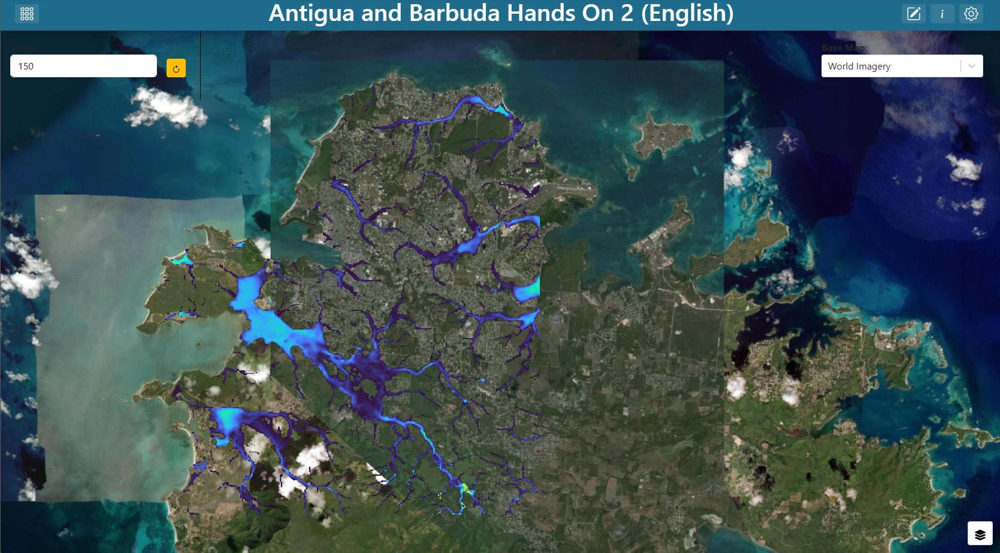
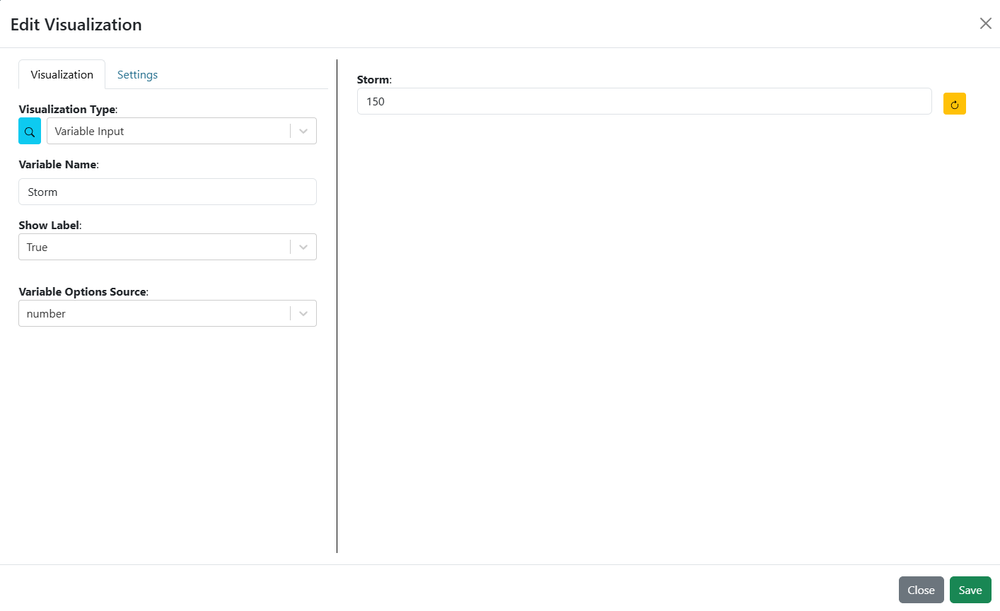
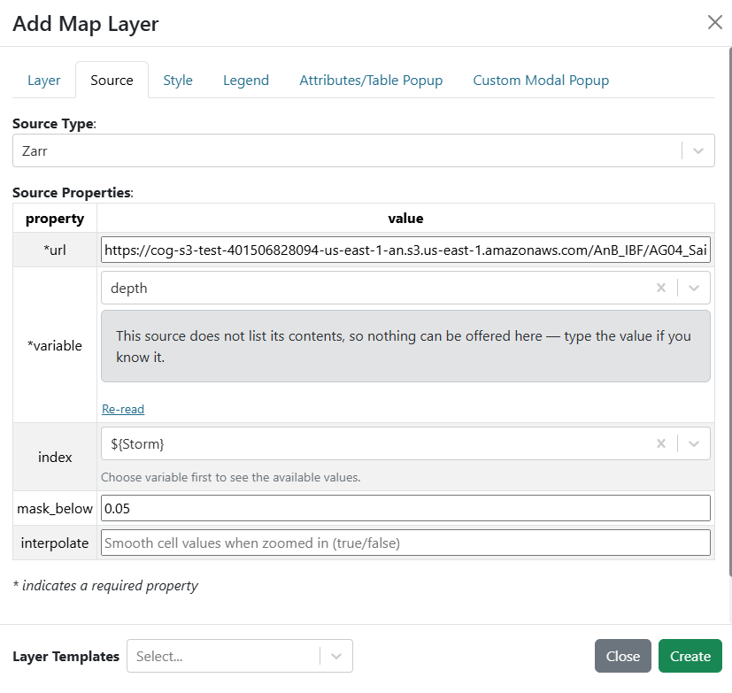

.. Antigua and Barbuda hands-on exercise 2 solution, English.

==============================================================
Exercise 2 — Flood depth for a single storm
==============================================================

Building **Antigua and Barbuda Hands On 2 (English)** step by step.

.. contents:: On this page
   :depth: 2
   :local:
   :backlinks: none

What you are building
=====================

A map filling the window, zoomed to Saint John's, showing the maximum flood
depth of one storm out of the parish's 200-storm flood-map library, with the
parish outlines over it. A slider in the top-right corner picks the storm, and
the depth re-reads.

   **Screenshot:** the finished dashboard — Saint John's over imagery, the
   depth of storm 150 in the turbo ramp, the **Storm** slider top-right.

New ideas here: reading a slice out of a Zarr store, a number input with a
slider and a play button, and a layer whose source is bound to a variable so
that changing the input re-reads the data instead of switching between
duplicated layers.

**Tip** — ``notebooks/Antigua_Barbuda/02_storm_impact.ipynb`` opens the same
library as plain Python: what the store's metadata says about itself, how one
storm is sampled onto every building and road in the parish, and how the
forecast turns the library into the probability rasters of exercises 1 and 3.
Worth running first if you want to understand the data before assembling the
interface.

**Note** — The Guatemala version of this exercise also adds a plugin-backed
impact layer, a summary table and a card for the chosen storm. Those plugins
are wired to the Guatemala ensemble and no Antigua and Barbuda variant exists
yet, so this dashboard stops at the depth layer. Section 10 of the notebook
lists what such a variant would need.

Step 1 — Create the dashboard
=============================

#. Create a new dashboard (see
   `Creating a dashboard <getting_started_en.rst#creating-a-dashboard>`_) with:

   * **Name**: ``Antigua and Barbuda Hands On 2 (English)``
   * **Description**: ``Solution for WMO Antigua and Barbuda Hands On Exercise #2``

#. Find your dashboard on the landing page and double-click it to open. The
   dashboard is empty, so the preview shows a blank canvas.

#. Open **Dashboard Settings** in the top-right corner, and turn on
   **Unrestricted Grid Item Movement**. Save the settings.

#. Exit **Dashboard Settings** and click **Edit Dashboard** in the top-right
   corner to enter edit mode.

Step 2 — Add the storm slider
=============================

#. You will see an existing item on the dashboard. Click on the item's 3-dot
   menu and select **Edit**.

#. Set the **Visualization Type** to **Variable Input** (in the **Default**
   group).

#. Fill in:

   .. list-table::
      :header-rows: 1
      :widths: 32 68

      * - Argument
        - Value
      * - ``variable_name``
        - ``Storm``
      * - ``show_label``
        - ``True``
      * - ``variable_options_source``
        - ``number``

#. A number input has its own settings, which appear once the source is
   ``number``. Set:

   .. list-table::
      :header-rows: 1
      :widths: 32 68

      * - Setting
        - Value
      * - **Data Type**
        - ``Number``
      * - **Output Format**
        - ``{{n}}`` (filled in for you when you pick Number)
      * - **Min**
        - ``1``
      * - **Max**
        - ``199``
      * - **Step**
        - ``1``

   The library holds 200 storms at positions 0 to 199, sorted by their rainfall
   total over the parish, so sliding right walks up in severity. Position 0
   never wets a cell — its rainfall total is 0.01 mm and its data chunk was
   never even written — so the slider starts at 1. Storm 1 floods nothing
   above 5 cm either; the map only starts to show water a little further up.

#. On the **Settings** tab, set **Background Color** to ``#ffffff`` and add a
   border on the left side only.

#. Set the initial value to ``150`` in the preview on the right side of the
   editor. Any storm is fine, but 150 is the one the notebook works through, and
   it floods enough of Saint John's to make the map worth looking at.

#. Save the item by clicking **Save** in the bottom-right corner of the item
   editor.

#. Drag the item to the top-right corner of the dashboard and resize it as
   needed.

#. Save the dashboard by clicking **Save Changes** in the top-right corner of
   the dashboard editor.

   **Screenshot:** the **Variable Input** arguments for the storm slider, source
   ``number``, range 1 to 199.

Step 3 — Add the base map selector
==================================

The base map is a variable input so the viewer can switch it without editing
anything. Build the input first, then point the map at it.

#. Set the dashboard in edit mode by clicking on the **Edit Dashboard** button
   in the top-right corner.

#. Add another item by clicking **Add Dashboard Item** in the top-right corner.

#. Click on the 3-dot menu of the new item and select **Edit**.

#. Set the **Visualization Type** to **Variable Input** (in the **Default**
   group).

#. Fill in:

   .. list-table::
      :header-rows: 1
      :widths: 32 68

      * - Argument
        - Value
      * - ``variable_name``
        - ``Base Map``
      * - ``show_label``
        - ``True``
      * - ``variable_options_source``
        - ``Base Map Layers``

   ``Base Map Layers`` is a built-in options source — it fills the dropdown with
   the base maps the instance offers, so you do not enumerate them yourself.

#. On the **Settings** tab, set **Background Color** to ``#ffffff``. Without it
   the dropdown floats on the map with no backing and is hard to read.

#. Select an initial value for the dropdown from the preview on the right side
   of the editor. The shipped solution uses ``World Imagery``.

#. Save the item by clicking **Save** in the bottom-right corner of the item
   editor.

#. Drag the item to the top-left corner and resize it as needed.

#. Save the dashboard by clicking **Save Changes** in the top-right corner of
   the dashboard editor.

   You now have a base map selector on the dashboard, but it does not yet
   control the map.

.. figure:: images/ex1-variable-input-basemap.png
   :alt: The base map variable input configuration
   :width: 100%

   **Screenshot:** the **Variable Input** arguments for the base map selector.

Step 4 — Add the map with the Zarr depth layer
==============================================

#. Set the dashboard in edit mode by clicking on the **Edit Dashboard** button
   in the top-right corner.

#. Add another item by clicking **Add Dashboard Item** in the top-right corner.

#. Click on the 3-dot menu of the new item and select **Edit**.

#. Set the **Visualization Type** to **Map** (in the **Default** group).

#. In the **Base Map** argument, choose ``Base Map`` from the **Variable
   Inputs** section at the bottom of the dropdown. The value becomes
   ``${Base Map}``.

#. Next to **Layers**, click **Add Layer**.

#. On the **Layer** tab, set the following properties:

   .. list-table::
      :header-rows: 1
      :widths: 24 76

      * - Field
        - Value
      * - ``name``
        - ``Flood Depth (m), Saint John's library``

#. On the **Source** tab, set **Source Type** to **Zarr** and fill in:

   .. list-table::
      :header-rows: 1
      :widths: 24 76

      * - Field
        - Value
      * - ``url``
        - ``https://cog-s3-test-401506828094-us-east-1-an.s3.us-east-1.amazonaws.com/AnB_IBF/AG04_SaintJohnS_v1.zarr``
      * - ``variable``
        - ``depth``
      * - ``index``
        - ``${Storm}``
      * - ``mask_below``
        - ``0.05``

   The ``index`` field is where this exercise becomes interactive. The store
   holds all 200 storms in one array of 200 × 465 × 428 cells, about 160 MB in
   total, and ``index`` selects the slice. Binding it to ``${Storm}`` means
   moving the slider re-reads a different slice — no duplicated layers, no
   separate files, and only one storm's worth of data crosses the wire.

   ``mask_below`` is ``0.05`` because that is the store's own wet threshold:
   its metadata says the model does not consider a cell flooded below 5 cm.
   Reusing the number the data was built with beats inventing one.

#. On the **Style** tab, leave the mode on **Continuous** and pick the **turbo**
   ramp. Leave **Min** and **Max** empty.

   Leaving both bounds empty means "resolve them from the data at render time",
   so the ramp stretches across whatever range this storm holds. Depth is a
   property of the particular storm, so auto-scaling is right here — the
   opposite of the probability layers in exercise 1, which had to be pinned
   to 0–1 so they could be compared with each other.

#. On the **Legend** tab, select **Default Legend**. For a ramp-styled raster
   the app generates a colour bar automatically.

#. Save the layer by clicking **Create** at the bottom of the layer editor.

   **Screenshot:** the **Source** tab with **Source Type** Zarr, the store URL,
   ``variable`` depth, ``index`` ``${Storm}`` and ``mask_below`` 0.05.

Step 5 — Add the parish boundaries and finish the map
=====================================================

#. Next to **Layers**, click **Add Layer** again and build the **Parishes**
   layer exactly as in `exercise 1, step 4 <exercise_1_en.rst#step-4-add-the-parish-boundaries>`_:
   **Source Type** **Shapefile**, the ``ATG_gadm_adm1_pop.shp`` URL, transparent
   fill and a 1-pixel black stroke.

   The library is windowed on Saint John's, so the depth stops dead at the
   parish edge. The outline shows that edge is the data's, not the flood's.

#. Save the layer by clicking **Create** at the bottom of the layer editor.

#. In the **Map Extent** argument, choose **Use a Custom Extent** and enter:

   .. code-block:: text

      -6884999.19,1933749.93,13

   That is ``centre-x,centre-y,zoom`` in EPSG:3857 metres, centred on Saint
   John's. Exercise 1 framed both islands at zoom 11.6; here only one parish
   has data, so the map opens on it.

#. On the **Settings** tab, turn on **Fill Viewport** so the map occupies the
   whole window.

#. Save the item by clicking **Save** in the bottom-right corner of the map
   editor.

#. Resize the map item to fill the window by dragging the handle in its
   bottom-right corner.

#. If the map is covering the storm slider and base map selector, click on the
   map's 3-dot menu, hover over **Order**, and select **Send to Back**. The
   inputs should now be visible on top of the map.

#. Save the dashboard by clicking **Save Changes** in the top-right corner of
   the dashboard editor.

Step 6 — Test the wiring
========================

Move the **Storm** slider. The depth layer re-reads its slice and the colour
bar re-scales to the new storm's range. Press the slider's play button and the
storms step through on their own — a quick way to see the flooded footprint
grow, and to notice that it does not grow monotonically.

Item positions
==============

The shipped solution places its items as follows, on the 100-column grid:

.. list-table::
   :header-rows: 1
   :widths: 40 15 15 15 15

   * - Item
     - ``x``
     - ``y``
     - ``w``
     - ``h``
   * - Map
     - 0
     - 0
     - 99
     - 41
   * - Base Map input
     - 0
     - 0
     - 15
     - 6
   * - Storm slider
     - 85
     - 0
     - 15
     - 7

Checkpoint
==========

You should now have:

* A map filling the window, opened on Saint John's, with the parish outlines.
* A **Storm** slider top-right running from 1 to 199, starting at 150.
* Moving it changes the depth raster; the legend's range follows.
* A layer control listing three layers (including the base map).
* Depth confined to the channels and low ground of Saint John's, ending at the
  parish boundary.

Talking points
==============

* **A slice, not a file.** The Zarr store is one array split into small chunks,
  so a storm can be read without downloading the other 199. That is what lets a
  slider drive a 160 MB dataset from a browser.
* **Position versus storm.** The slider value is a position in a library sorted
  by rainfall total. The store's ``index.csv`` maps each position to the
  scenario it came from and its magnitude in millimetres — real RainyDay storm
  totals, area-weighted over the parish. The Guatemala ensemble's magnitudes
  were placeholders; these are not, so plotting impact against them is
  legitimate.
* **Magnitude orders the library, not the impact.** Step through the storms and
  the flooded area does not rise smoothly: a larger parish total can flood less
  if the rain fell on the wrong side of the parish. That is why the forecast
  matches a member to a storm by total and then reads impact off the depth map,
  never off the magnitude.
* **Depth saturates at 2.55 m.** The library stored depth as whole centimetres
  in a byte. A cell at 2.55 means *at least* 2.55, so the top of the colour bar
  on a big storm is a floor, not a maximum.
* **Auto-scaled versus pinned.** Depth auto-scales because its range belongs to
  this storm. Probability was pinned in exercise 1 because its range is fixed
  by definition. Which one a layer needs is the first question to ask of any
  ramp.
* **Where exercise 3 comes from.** Each of the forecast's 50 members is matched
  to the library storm with the closest rainfall total, and P(≥ 30 cm) at a
  cell is the share of members whose matched storm floods it to 30 cm. The
  depth you are sliding through is the raw material of the probability rasters.

Next
====

`Exercise 3 — Hazard classification with adjustable thresholds <exercise_3_en.rst>`_
turns the probability thresholds over to the viewer, and its last step shows
how to drop this depth layer into that dashboard.
