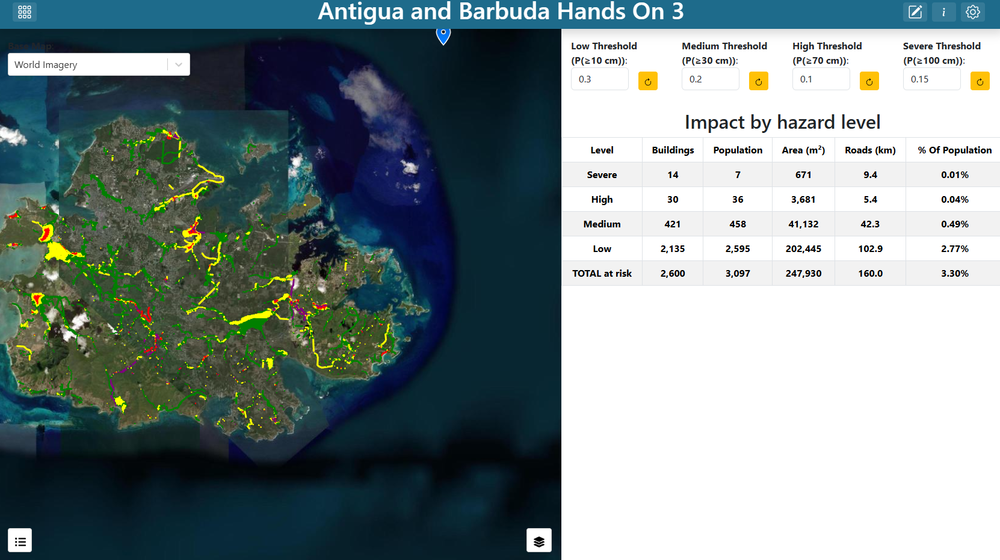
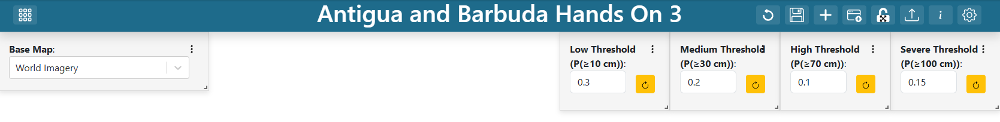
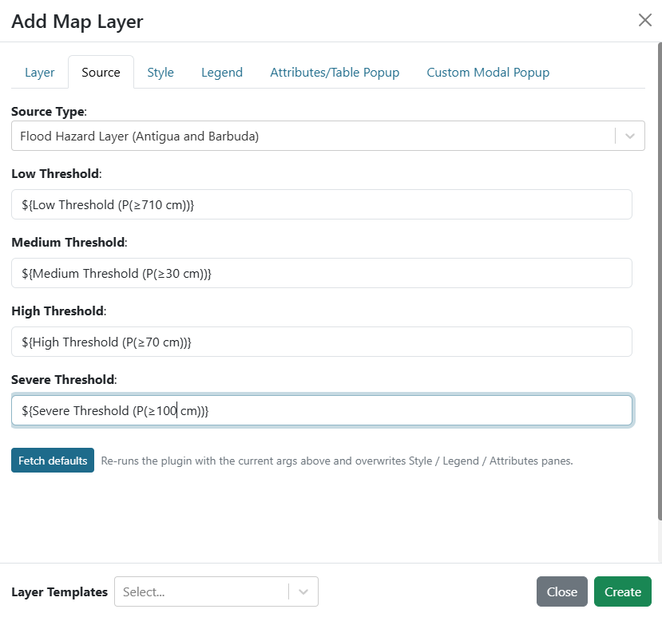
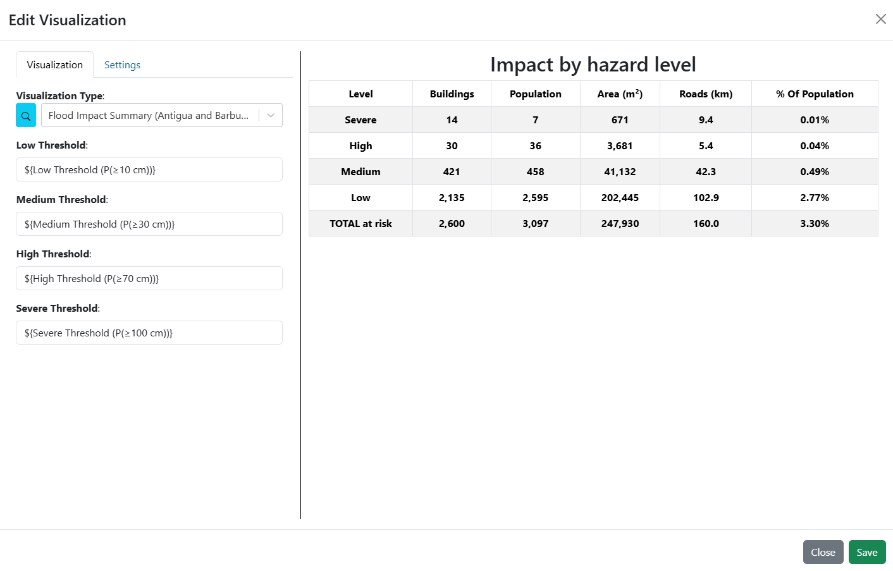
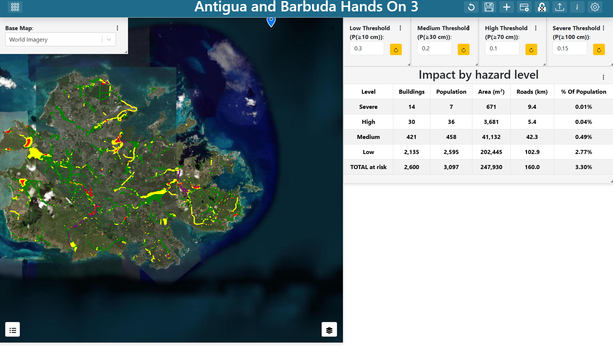
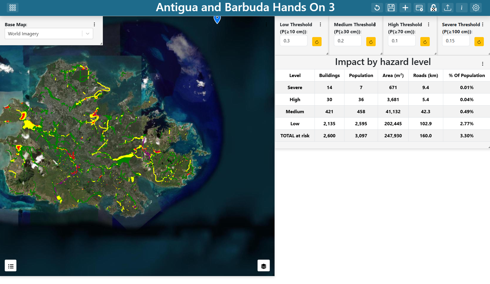

.. Antigua and Barbuda hands-on exercise 3 solution.

==============================================================
Exercise 3 — Hazard classification with adjustable thresholds
==============================================================

Building **Antigua and Barbuda Hands On 3** step by step.

**Start here** — This exercise reuses the map from
`Exercise 1 <exercise_1.rst>`_, so building that one first will save you time.

.. contents:: On this page
   :depth: 2
   :local:
   :backlinks: none

What you are building
=====================

A full-window map carrying the four probability rasters and the parish outline
from exercise 1 (without its depth layer) plus two computed layers: a hazard classification and the
buildings and roads that fall inside it. Four number inputs across the top set
the probability threshold for each hazard level, and an impact table sits under
them. Change a threshold and the classification, the affected features and the
table all recompute.

   **Screenshot:** the finished dashboard — full-window map of both islands,
   four threshold inputs along the top right, impact table under them.

**Tip** — ``notebooks/Antigua_Barbuda/03_hazard_classification.ipynb`` derives
this classification as plain Python, including a gate sweep that shows what
each threshold controls, a per-parish exposure table, and a check of the
geopackage's own ``hazard_flag`` against the rule. Worth running first if you
want to understand the analysis before assembling the interface.

Understanding the four thresholds
=================================

Each hazard level is tied to **one** depth threshold and has its **own**
probability gate:

.. list-table::
   :header-rows: 1
   :widths: 18 32 25 25

   * - Level
     - Driven by
     - Colour
     - Plugin default gate
   * - Low
     - P(≥ 10 cm)
     - green
     - 0.3
   * - Medium
     - P(≥ 30 cm)
     - yellow
     - 0.2
   * - High
     - P(≥ 70 cm)
     - red
     - 0.1
   * - Severe
     - P(≥ 100 cm)
     - purple
     - 0.15

A cell takes the level of the **deepest** threshold whose gate it clears. The
gates are not monotonic and do not need to be: a deeper threshold is rarer, so
a lower gate on it says "take a one-in-ten chance of 70 cm as seriously as a
one-in-three chance of ankle depth".

**Note** — Two things to know before you present this, both covered at length
in the notebook:

**Probabilities move in steps of 0.02** — one member in fifty — and take few
distinct values, because five rainfall realizations drive most of the spread.
Sliding a gate therefore moves the classification in plateaus: nothing changes
for several steps, then a whole footprint changes level at once.

**Every level is reachable.** Each of the four rasters reaches 1.0 somewhere,
so no gate setting empties a class outright — unlike the Guatemala data, where
the deepest layer never exceeded 0.2. What a high Severe gate does here is
shrink the purple to the few buildings every member floods, which is a
different and more useful conversation.

Step 1 — Create the dashboard
=============================

#. Create a new dashboard (see
   `Creating a dashboard <getting_started.rst#creating-a-dashboard>`_) with:

   * **Name**: ``Antigua and Barbuda Hands On 3``
   * **Description**: ``Solution for WMO Antigua and Barbuda Hands On Exercise #3``

#. Find your dashboard on the landing page and double-click it to open. The
   dashboard is empty, so the preview shows a blank canvas.

#. Open **Dashboard Settings** in the top-right corner, and turn on
   **Unrestricted Grid Item Movement**. Save the settings.

#. Exit **Dashboard Settings** and click **Edit Dashboard** in the top-right
   corner to enter edit mode.

Step 2 — Add the base map selector
==================================

The base map is a variable input so the viewer can switch it without editing
anything. Build the input first, then point the map at it.

#. You will see an existing item on the dashboard. Click on the item's 3-dot
   menu and select **Edit**.

#. Set the **Visualization Type** to **Variable Input** (in the **Default**
   group).

#. Fill in:

   .. list-table::
      :header-rows: 1
      :widths: 32 68

      * - Argument
        - Value
      * - ``variable_name``
        - ``Base Map``
      * - ``show_label``
        - ``True``
      * - ``variable_options_source``
        - ``Base Map Layers``

   ``Base Map Layers`` is a built-in options source — it fills the dropdown with
   the base maps the instance offers, so you do not enumerate them yourself.

#. On the **Settings** tab, set **Background Color** to ``#ffffff`` and add a
   border on all four sides.

#. Select an initial value for the dropdown from the preview on the right side
   of the editor. The shipped solution uses ``World Imagery``.

#. Save the item by clicking **Save** in the bottom-right corner of the item
   editor.

#. Drag the item to the top-left corner and resize it as needed.

#. Save the dashboard by clicking **Save Changes** in the top-right corner of
   the dashboard editor.

   You now have a base map selector on the dashboard, but it does not yet
   control the map.

.. figure:: images/ex1-variable-input-basemap.png
   :alt: The base map variable input configuration
   :width: 100%

   **Screenshot:** the **Variable Input** arguments for the base map selector.

Step 3 — Add the four threshold inputs
======================================

Build all four before the layers that consume them. Each is a **Variable Input**
with ``variable_options_source`` set to ``number``:

.. list-table::
   :header-rows: 1
   :widths: 70 30

   * - ``Variable Name``
     - Initial value
   * - ``Low Threshold (P(≥10 cm))``
     - ``0.3``
   * - ``Medium Threshold (P(≥30 cm))``
     - ``0.2``
   * - ``High Threshold (P(≥70 cm))``
     - ``0.1``
   * - ``Severe Threshold (P(≥100 cm))``
     - ``0.15``

The initial values are the plugin defaults, so the dashboard opens showing the
same classification the plugins would compute with no inputs bound at all.

For **each** of the four:

#. Set the dashboard in edit mode by clicking on the **Edit Dashboard** button
   in the top-right corner.

#. Add another item by clicking **Add Dashboard Item** in the top-right corner.

#. Click on the 3-dot menu of the new item and select **Edit**.

#. Set the **Visualization Type** to **Variable Input** (in the **Default**
   group).

#. Fill in:

   .. list-table::
      :header-rows: 1
      :widths: 32 68

      * - Argument
        - Value
      * - ``variable_name``
        - *see the table above*
      * - ``show_label``
        - ``True``
      * - ``variable_options_source``
        - ``number``

#. On the **Settings** tab, set **Background Color** to ``#ffffff``.

#. On the **Settings** tab, add a top border by clicking the top border icon. A
   popup will appear. Change the style to ``solid`` to show the border.

   Give the leftmost input (``Low Threshold``) a left border and the rightmost
   (``Severe Threshold``) a right border as well, so the four read as one strip.

#. Set the initial value from the table above in the preview on the right side
   of the editor.

#. Save the item by clicking **Save** in the bottom-right corner of the item
   editor.

#. Drag the item into place along the top of the dashboard, in the right-hand
   half, and resize it as needed. The four sit side by side, Low to Severe.

#. Save the dashboard by clicking **Save Changes** in the top-right corner of
   the dashboard editor.

   **Screenshot:** the four threshold inputs side by side, each showing its
   label and value.

Step 4 — Add the map, the four rasters and the parishes
=======================================================

If you have exercise 1, do the following. If you do not, build the map, the
four probability rasters and the parish outline from scratch as in
`Exercise 1 <exercise_1.rst>`_, skipping its depth layer.

#. Open the dashboard from exercise 1.

#. Click on the map item's 3-dot menu and choose **Export**.

#. Open the new dashboard for this exercise.

#. Click **Edit Dashboard** in the top-right corner to enter edit mode.

#. Click **Import Dashboard Item** in the top-right corner and import the
   dashboard item from exercise 1.

#. If the map is covering the inputs, click on its 3-dot menu, hover over
   **Order**, and select **Send to Back**. The inputs should now be visible on
   top of the map.

#. Edit the map item. Delete the **Flood Depth** layer: it is one storm of one
   parish's library, and this dashboard is about the forecast. Step 10 brings
   it back on a slider if you want it.

#. For each of the four probability rasters, edit the layer and turn off
   **Default Visibility** on the **Layer** tab, so that all four are hidden
   when the dashboard first loads. Leave **Parishes** visible. Make sure to
   save each layer after editing it.

   The probabilities stay available in the layer control for anyone who wants
   to see the raw surface behind the classification, but the classification is
   the product here and the rasters would cover it.

#. Save the dashboard by clicking **Save Changes** in the top-right corner of
   the dashboard editor.

Step 5 — Add the hazard classification layer
============================================

#. Set the dashboard in edit mode by clicking on the **Edit Dashboard** button
   in the top-right corner.

#. Click on the map item's 3-dot menu and select **Edit**. You may need to move
   one of the inputs out of the way to see the map menu.

#. Next to **Layers**, click **Add Layer**.

#. Go straight to the **Source** tab and set **Source Type** to
   **Flood Hazard Layer (Antigua and Barbuda)**. Dynamic map-layer plugins
   appear in the same **Source Type** dropdown as GeoTIFF and Shapefile, listed
   under their plugin group.

#. The plugin's arguments appear. Fill in:

   .. list-table::
      :header-rows: 1
      :widths: 26 74

      * - Argument
        - Value
      * - ``low_threshold``
        - ``${Low Threshold (P(≥10 cm))}``
      * - ``medium_threshold``
        - ``${Medium Threshold (P(≥30 cm))}``
      * - ``high_threshold``
        - ``${High Threshold (P(≥70 cm))}``
      * - ``severe_threshold``
        - ``${Severe Threshold (P(≥100 cm))}``

   See `Referencing a variable input
   <getting_started.rst#referencing-a-variable-input>`_ for the two forms
   this reference can take.

#. Click **Fetch plugin defaults**.

   This is the step that saves the most work. The plugin's ``run()`` returns a
   ready-made scaffold — the layer name, the source binding, a rule-based style
   keyed on the ``peligro`` (hazard class) attribute, and a matching legend.
   After fetching you should see the layer named **Hazard classification**,
   four style rules, and a four-item **Hazard** legend, none of which you had
   to author. Authoring vector style rules by hand is error-prone: a rule in
   the wrong shape silently never matches and leaves every feature grey.

#. Save the layer by clicking **Create** at the bottom of the layer editor.

   **Screenshot:** the **Source** tab for the hazard layer, four arguments bound
   to the four threshold variables, and the **Fetch plugin defaults** button.

Step 6 — Add the affected-features layer
========================================

#. Next to **Layers**, click **Add Layer** again.

#. Go straight to the **Source** tab and set **Source Type** to
   **Flood Impact Layer (Antigua and Barbuda)**.

#. Bind the same four arguments to the same four variables as in the previous
   step.

#. Click **Fetch plugin defaults**. The layer arrives as **Buildings and roads
   at risk** with eight rules (polygon and linestring per level) and a
   **Hazard** legend.

#. Save the layer by clicking **Create** at the bottom of the layer editor.

The two layers answer different questions from the same thresholds: the hazard
layer classifies *ground*, this one classifies *assets*. Keeping them separate
lets a viewer turn off the ground shading and look only at what is affected.
The features come from the IBF geopackage, which already carries the four
probabilities sampled onto each of the 71,136 buildings and 9,315 road
segments, so this layer never touches the rasters.

Step 7 — Finish the map
=======================

#. In the **Map Extent** argument, keep exercise 1's extent, which frames both
   islands:

   .. code-block:: text

      -6878431.34,1928974.98,11.6

#. On the **Settings** tab, confirm **Fill Viewport** is on so the map occupies
   the whole window.

#. Save the item by clicking **Save** in the bottom-right corner of the map
   editor.

#. Resize the map item to fill the window by dragging the handle in its
   bottom-right corner.

#. Make sure to move any input you shifted back into place.

#. Save the dashboard by clicking **Save Changes** in the top-right corner of
   the dashboard editor.

Step 8 — Add the impact summary table
=====================================

#. Set the dashboard in edit mode by clicking on the **Edit Dashboard** button
   in the top-right corner.

#. Add another item by clicking **Add Dashboard Item** in the top-right corner.

#. Click on the 3-dot menu of the new item and select **Edit**.

#. Set the **Visualization Type** to
   **Flood Impact Summary (Antigua and Barbuda)** (in the
   **Flood Maps (English)** group).

#. Bind the same four arguments to the same four variables as in step 5.

   The table breaks the features at risk into hazard levels, deepest first,
   with counts of buildings, population, floor area, road length and the share
   of the country's population affected. The population figures are the
   geopackage's per-building estimates — the parish total spread over the
   residential buildings by built-up area — not a census.

#. On the **Settings** tab, set **Background Color** to ``#ffffff`` and add
   borders on the left, right and bottom, so it joins the strip of threshold
   inputs above it.

#. Save the item by clicking **Save** in the bottom-right corner of the item
   editor.

#. Drag the item directly below the threshold inputs on the right and resize it
   as needed.

#. Save the dashboard by clicking **Save Changes** in the top-right corner of
   the dashboard editor.

   **Screenshot:** the impact summary table arguments bound to the four
   threshold variables.

Step 9 — Test the wiring
========================

Update a threshold. The hazard shading, the affected features and the table
should all recompute together, with progress messages while the layers rebuild.
As a demonstration, raise the Severe threshold from 0.15 to 0.5. The purple
shrinks to the ground and buildings that at least half the members flood to a
metre, and the Severe row of the table drops with it — but does not empty.
Then set all four gates to the same value and watch the levels line up by
depth alone.

   **Screenshot:** Saint John's at the default gates.

   **Screenshot:** the same view with the Severe threshold at 0.5.

Step 10 — Optional: add the depth layer from exercise 2
=======================================================

**Antigua and Barbuda Hands On 3 with Depth** is this dashboard with
exercise 2's storm slider and depth layer added, so one screen shows how deep
the water gets in one library storm next to which features the probability
gates classify. To build it:

#. Add a **Storm** variable input exactly as in
   `exercise 2, step 2 <exercise_2.rst#step-2-add-the-storm-slider>`_, and
   place it just right of the base map selector.

#. Edit the map, add the **Flood Depth (m), Saint John's library** Zarr layer
   exactly as in `exercise 2, step 4 <exercise_2.rst#step-4-add-the-map-with-the-zarr-depth-layer>`_,
   and drag it in the layer list so it sits **above** the four probability
   rasters and **below** the parishes and the two plugin layers.

#. Edit the **Hazard classification** layer and turn off its
   **Default Visibility**. Its polygons are opaque and would cover the depth;
   viewers can switch it on from the layer control.

#. Change the **Map Extent** to exercise 2's Saint John's view,
   ``-6884999.19,1933749.93,13``, because the depth library covers only that
   parish.

#. Save the layer, the map and the dashboard.

Item positions
==============

The shipped solution places its items as follows, on the 100-column grid:

.. list-table::
   :header-rows: 1
   :widths: 40 15 15 15 15

   * - Item
     - ``x``
     - ``y``
     - ``w``
     - ``h``
   * - Map
     - 0
     - 0
     - 99
     - 41
   * - Base Map input
     - 0
     - 0
     - 17
     - 6
   * - Low Threshold input
     - 56
     - 0
     - 11
     - 7
   * - Medium Threshold input
     - 67
     - 0
     - 11
     - 7
   * - High Threshold input
     - 78
     - 0
     - 11
     - 7
   * - Severe Threshold input
     - 89
     - 0
     - 11
     - 7
   * - Impact summary table
     - 56
     - 7
     - 44
     - 21

In the **with Depth** variant the base map input is 17 columns wide and the
**Storm** slider sits at ``x`` 17, ``y`` 0, 14 wide and 6 high.

Checkpoint
==========

You should now have:

* A map filling the window, with eight layers in the layer control (including
  the base map); the four probability rasters unchecked, the parishes, the
  hazard classification and the features at risk checked.
* Four labelled threshold inputs across the top right.
* Moving any threshold updates the hazard layer, the impact layer and the table.
* Raising the Severe threshold shrinks the purple but never removes it — every
  level is reachable in this data.
* Progress messages while the layers recompute.

Talking points
==============

* **Four gates on four different questions.** "Severe" means P(≥ 100 cm) ≥ 0.15
  while "High" means P(≥ 70 cm) ≥ 0.1. Those are different questions with
  different cutoffs, so the level names are not comparable to each other and
  "severe" carries no meaning on its own. Setting all four gates equal is a good
  demonstration: the levels then differ only by depth, which is far easier to
  explain — and it is what the IBF workflow that produced the geopackage did.
  The notebook recovers the single gate it used from the data.
* **Plateaus are the data, not the interface.** With probabilities in steps of
  0.02 and few distinct values, a gate can move three steps and change nothing,
  then move one more and reclassify a whole neighbourhood. Ask attendees how
  they would tell a decision-maker that a threshold of 0.20 and one of 0.24
  give the same map.
* **Parish is the unit.** Antigua and Barbuda issues warnings by parish, and
  the table's population share is against both islands together. The notebook
  breaks the same exposure down per parish; ask which denominator a parish
  disaster coordinator wants, and which the national office wants.
* **Vectorising a classification.** A map layer can only point at a URL, and
  nothing here serves a computed raster, so the plugin vectorises the classified
  grid into about 3,400 polygons at the default gates. Adjacent cells of equal
  class merge, so this is exact rather than an approximation. Normal and NoData
  are dropped because a basemap shows unaffected ground better than a coloured
  layer does.
* **Two products, one grid.** Exercise 2 answered "how deep in storm 150", this
  one "what are the odds of 30 cm". Both use the same buildings on the same
  30 m lattice; the *with Depth* dashboard puts them side by side. Which would
  you put in front of the duty officer, and what would you say about the other?
