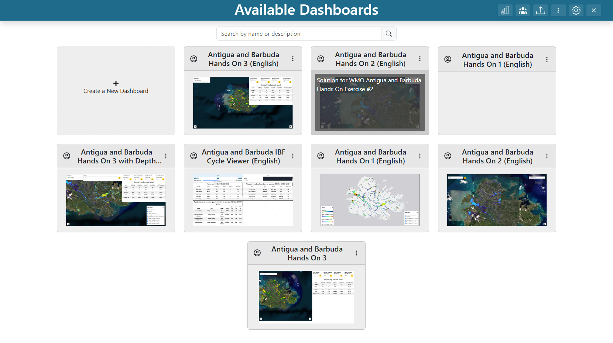
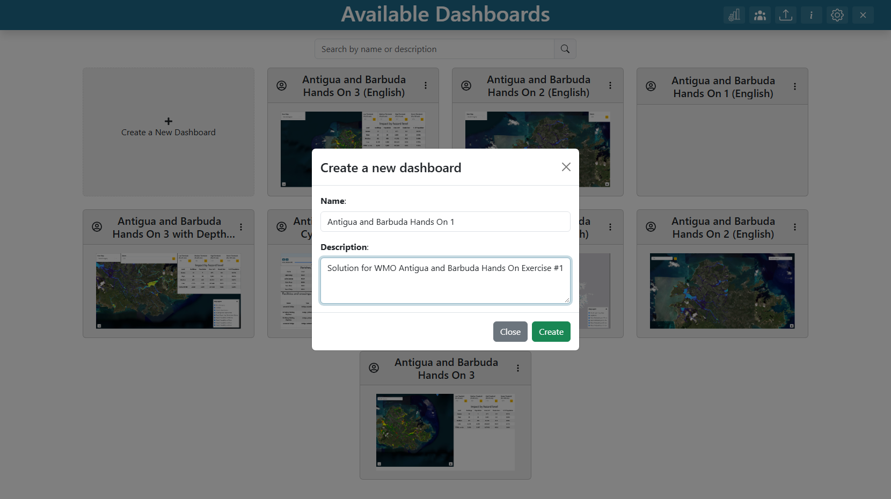
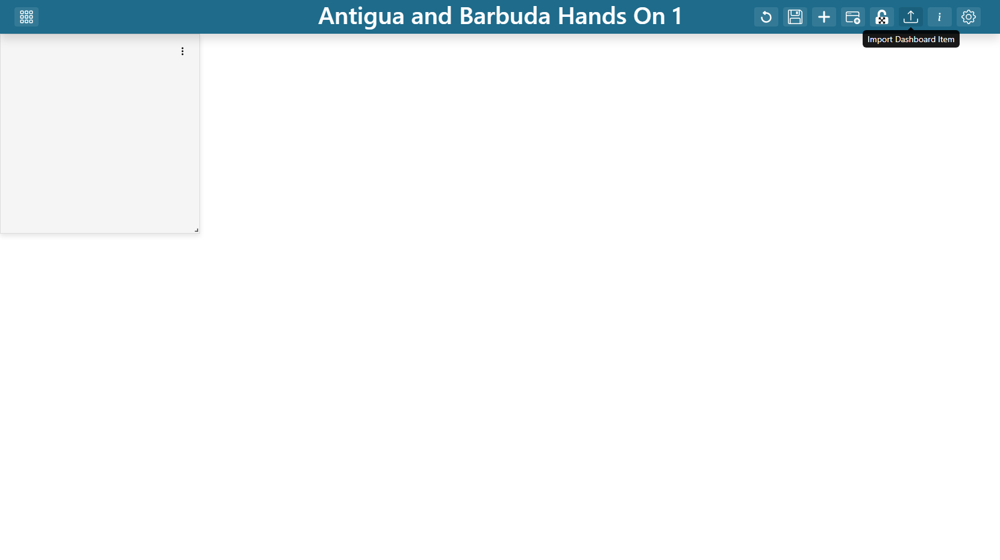
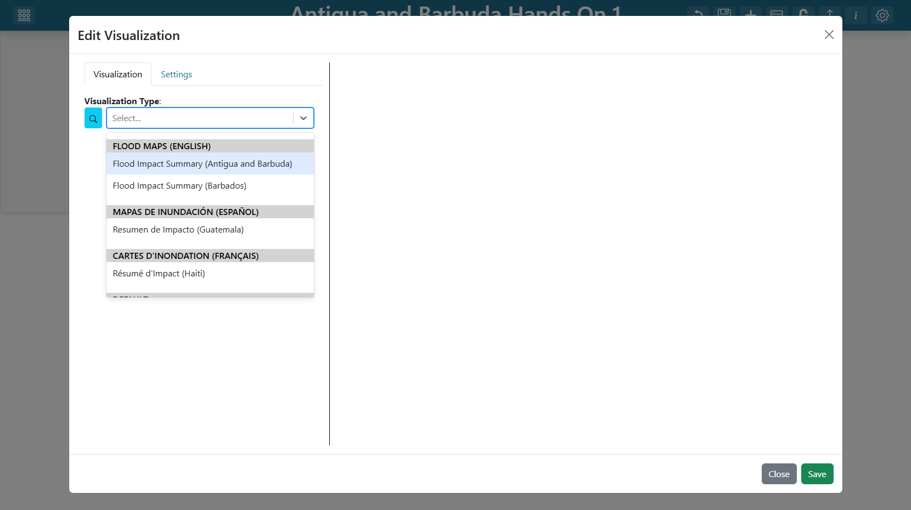
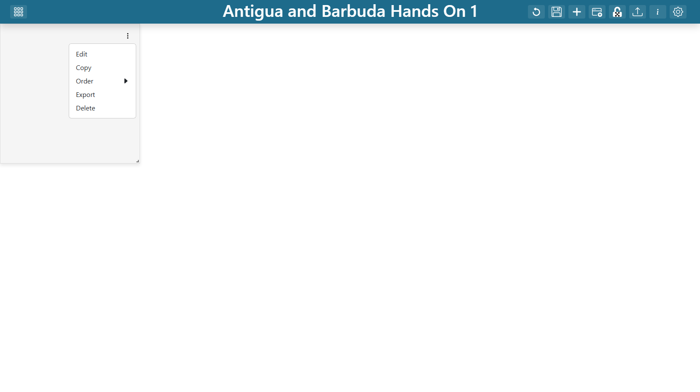

.. Shared front matter for the Antigua and Barbuda hands-on exercise guides,
.. English. The Guatemala guides this set was adapted from live in ../Guatemala/.

==================================================================
Antigua and Barbuda Hands-On Exercises: Getting Started
==================================================================

Setup, background and the motions that repeat in every exercise. Read this once,
then work through whichever exercise you need.

.. contents:: On this page
   :depth: 2
   :local:
   :backlinks: none

The three exercises
===================

Each exercise builds one dashboard and lives in its own file:

.. list-table::
   :header-rows: 1
   :widths: 30 24 46

   * - Guide
     - Dashboard
     - What it shows
   * - `Exercise 1 — A flood depth and probability map <exercise_1_en.rst>`_
     - Antigua and Barbuda Hands On 1 (English)
     - Flood depth for one storm of the Saint John's flood-map library and the
       four exceedance-probability rasters of the Tropical Storm Jerry forecast
       on one map, with the parish boundaries and a switchable base map.
   * - `Exercise 2 — Flood depth for a single storm <exercise_2_en.rst>`_
     - Antigua and Barbuda Hands On 2 (English)
     - Maximum flood depth for one storm out of the 200-storm Saint John's
       flood-map library, chosen with a slider.
   * - `Exercise 3 — Hazard classification with adjustable thresholds <exercise_3_en.rst>`_
     - Antigua and Barbuda Hands On 3 (English)
     - A hazard classification driven by four probability thresholds the viewer
       can move, with the affected buildings and roads and an impact table.

The exercises are cumulative in difficulty, not in content — each is a separate
dashboard, and each can be built on its own. Exercise 1 teaches raster and vector
layers, 2 puts the depth layer's storm on a variable input, 3 adds plugin-backed
layers and interactivity through four inputs at once.

A fourth dashboard, **Antigua and Barbuda Hands On 3 with Depth (English)**,
is exercise 3 with exercise 2's depth layer dropped in. It is not a separate
exercise; the last step of the exercise 3 guide explains how to assemble it.

Companion notebooks
-------------------

``notebooks/Antigua_Barbuda/02_storm_impact.ipynb`` and
``notebooks/Antigua_Barbuda/03_hazard_classification.ipynb`` derive the numbers
behind exercises 2 and 3 as plain Python. These guides cover *building the
dashboard*; the notebooks cover *why the numbers are what they are*. They pair
well: run the notebook first if you want to understand the analysis, follow the
guide if you want to assemble the interface. Both notebooks also run on Google
Colab.

Conventions
-----------

* **Bold** marks something you click or a field label exactly as it appears in
  the interface, e.g. **Add Layer**, **Source Type**.
* ``Monospace`` marks a value you type or paste.
* Steps are numbered. Where the order does not matter, that is said explicitly.
* Every exercise ends with a **Checkpoint** listing what you should be able to
  see, and **Talking points** worth raising if you are teaching from it.

**Note** — Screenshots in these guides are placeholders. Each ``figure`` block
names what the image should show; drop a PNG at the given path under
``docs/Antigua_Barbuda/images/`` and it will render. The Guatemala guides under
``docs/Guatemala/`` carry screenshots of the same dialogs, if you want to see
what a step looks like before the Antigua and Barbuda captures exist.

Before you begin
================

What you need
-------------

#. **A TethysDash instance you can create dashboards on.** You need to be able
   to reach the landing page and create a dashboard, which means an account with
   dashboard-creation rights.
#. **The** ``tgf_wmo_plugins`` **package installed on the server**, not just on
   your laptop. Visualization plugins are discovered on the backend through
   Intake's entry points, so the app process must be able to import them:

   .. code-block:: bash

      pip install git+https://github.com/Aquaveo/tgf_wmo_plugins.git

   Restart the Tethys app after installing. To confirm it worked, open any
   dashboard item's **Visualization Type** dropdown and look for
   **Flood Impact Summary (Antigua and Barbuda)** in the
   **Flood Maps (English)** group.
#. **Outbound HTTPS from the server.** Every plugin reads its data from a public
   S3 bucket at request time. Nothing is bundled with the package.
#. **Visualization permissions**, if your instance restricts plugin types. The
   exercises use the ``table`` and ``map_layer`` types.

**Warning** — If the **Flood Maps (English)** group is missing from the
dropdown, the package is not installed in the environment the app is actually
running in. That is by far the most common setup problem. Installing into your
shell's Python is not enough when the app runs under a different interpreter or
container.

The event
---------

Every dataset in these exercises comes from one forecast cycle of the UFFIS
chain for **Tropical Storm Jerry**, which in October 2025 dropped about 167 mm
in four hours on V.C. Bird airport. The forecast
had 50 rainfall members: five StormLab realizations run from each of ten
satellite-rainfall analysis states. The chain does not run a hydraulic model
when a storm approaches. Instead, each parish has a library of 200 synthetic
storms with precomputed maximum-depth maps, each member's rainfall total selects
the closest library storm, and the probability of exceeding a depth at a cell is
simply the share of the 50 members whose matched storm floods that cell to that
depth. Exercise 2 opens the library; exercises 1 and 3 use the probabilities it
produced.

The data
--------

Everything comes from one public bucket. The root is the same throughout, and
the exercises refer to it as ``.../``:

.. code-block:: text

   https://cog-s3-test-401506828094-us-east-1-an.s3.us-east-1.amazonaws.com

Two prefixes matter:

.. list-table::
   :header-rows: 1
   :widths: 26 74

   * - Prefix
     - Contents
   * - ``antigua_barbuda_IBF/``
     - The forecast outputs. ``depth_prob/`` holds the four
       exceedance-probability GeoTIFFs (10, 30, 70 and 100 cm), ``gadm/`` the
       parish boundaries as a shapefile, and the geopackage
       ``AntiguaBarbuda_Jerry_cycle_10151010_IBF_outputs.gpkg`` carries the
       71,136 buildings and 9,315 road segments with the four probabilities
       already sampled onto them. The exercise 3 plugins read from here.
   * - ``AnB_IBF/``
     - The flood-map libraries, one Zarr store per parish
       (``AG01_Barbuda_v1.zarr`` through ``AG08_SaintPhilip_v1.zarr``, seven in
       all). Each holds 200 storms of maximum depth in metres. Exercises 1
       and 2 read the Saint John's store, ``AG04_SaintJohnS_v1.zarr``.

All of the rasters, and the libraries, sit on one lattice: **EPSG:4326** at one
arc-second (about 30 m), the probability rasters covering both islands at
2658 × 921 cells and each library windowed on its parish. TethysDash ships no
proj4, so OpenLayers can resolve only EPSG:4326 and EPSG:3857 for layer data —
and these rasters are already in the first, so nothing needs reprojecting. That
is a real difference from the Guatemala exercises, whose rasters had to be
copied out of UTM first.

Two things about the data are worth knowing before you present it, both worked
through in the notebooks:

* **Depth saturates at 2.55 m.** The libraries stored depth as whole
  centimetres in a byte, so a cell at 2.55 means *at least* 2.55, and no band
  above about 2 m is distinct from the one below it.
* **Probabilities move in steps of 0.02** and take few distinct values, because
  five rainfall realizations drive most of the spread between 50 members. Every
  probability layer does reach 1.0 somewhere, so — unlike Guatemala — the top
  hazard level is reachable at any threshold.

Groundwork common to all three exercises
========================================

These motions repeat in every exercise. They are spelled out once here, and the
exercises refer back to them as "create the dashboard" and "add a dashboard
item".

Creating a dashboard
--------------------

#. From the landing page, click the **Create a New Dashboard** card.
#. Fill in **Name** and **Description**, then click **Create**.
#. The new dashboard opens empty.

   **Screenshot:** the landing page, with the **Create a New Dashboard** card
   visible.

   **Screenshot:** the new-dashboard modal, Name and Description filled in.

Entering edit mode
------------------

A dashboard can only be changed by its owner, and only in edit mode. Click the
**Edit Dashboard** button in the header. The header then offers:

.. list-table::
   :header-rows: 1
   :widths: 34 66

   * - Button
     - What it does
   * - **Add Dashboard Item**
     - Adds a new, unconfigured item to the layout.
   * - **Lock/Unlock Movement**
     - Freezes item positions so you can click without dragging.
   * - **Import Dashboard Item**
     - Loads an item from an exported configuration file.
   * - **Dashboard Settings**
     - Name, description, thumbnail, sharing, notes, and
       **Unrestricted Grid Item Movement**.
   * - **Save Changes**
     - Persists the layout.
   * - **Cancel**
     - Discards changes back to the last save.

   **Screenshot:** the header toolbar in edit mode, with the buttons above
   visible.

**Tip** — Save often. **Cancel** reverts to the last save, so a long unsaved
editing session is a single mistake away from being lost.

Adding and configuring a dashboard item
---------------------------------------

#. In edit mode, click **Add Dashboard Item**. An empty item appears.
#. Click the item's **3-dot menu** and select **Edit**. The data viewer
   modal opens.
#. On the **Visualization** tab, pick a **Visualization Type**. Arguments for
   that visualization appear underneath.
#. Fill the arguments in. The preview updates as you go.
#. Switch to the **Settings** tab for item-level options — borders, background,
   **Fill Viewport**. Settings only become available once a visualization is
   configured and previewing.
#. Click **Save** in the bottom-right corner of the item editor to apply,
   then **Save Changes** in the top-right corner of the dashboard editor to
   persist.

   **Screenshot:** the data viewer with the **Visualization Type** dropdown open,
   showing the **Flood Maps (English)** group.

   **Screenshot:** an item's 3-dot menu, showing Edit, Create Copy, Export
   and Delete.

Sizing and placing items
------------------------

Drag an item by its body, resize it from the handle in its lower-right corner.
The grid is 100 columns wide. All three solutions turn on
**Unrestricted Grid Item Movement** (in **Dashboard Settings**), which lets items
sit anywhere and overlap — needed here so the controls and panels can float over
a full-bleed map.

Each exercise ends with an **Item positions** table giving the exact ``x``, ``y``,
``w`` and ``h`` of every item in that solution. You do not need to match them to
the pixel; drag to something close and adjust.

Referencing a variable input
----------------------------

All three exercises wire visualizations to variable inputs. There are two ways to
write the reference, depending on the argument:

* **Dropdown-type arguments** list the available variables in a
  **Variable Inputs** section at the bottom of the dropdown — pick from there.
* **Free-text arguments** take the template syntax ``${Variable Name}``, typed by
  hand.

The name inside the braces must match the input's ``variable_name`` exactly,
spaces and punctuation included. Build the variable input *before* the items that
reference it, or there will be nothing to select.

Importing a finished solution
=============================

To reset between sessions, or to check your work, the finished dashboards are in
this repository under ``dashboards/Antigua_Barbuda/``:

.. code-block:: text

   dashboards/Antigua_Barbuda/Antigua_Barbuda_Hands_On_1_English.json
   dashboards/Antigua_Barbuda/Antigua_Barbuda_Hands_On_2_English.json
   dashboards/Antigua_Barbuda/Antigua_Barbuda_Hands_On_3_English.json
   dashboards/Antigua_Barbuda/Antigua_Barbuda_Hands_On_3_Depth_English.json

These files are whole-dashboard exports. Individual items can also be moved
between dashboards through **Export** on an item's 3-dot menu and
**Import Dashboard Item** in the header, which is the quickest way to reuse
exercise 1's map in exercise 3.

Troubleshooting
===============

.. list-table::
   :header-rows: 1
   :widths: 40 60

   * - Symptom
     - Cause and fix
   * - The **Flood Maps (English)** group is missing from
       **Visualization Type**, or it has no **(Antigua and Barbuda)** entries.
     - ``tgf_wmo_plugins`` is not installed in the environment the app runs in,
       it is an older version without the Antigua and Barbuda variants, or the
       app was not restarted. Install it server-side and restart.
   * - A visualization says a variable is empty.
     - The ``${...}`` name does not match a ``variable_name`` exactly, or the
       variable input was added after the item that references it. Check
       spelling, spaces and punctuation, then re-select the variable.
   * - The map is blank where the depth layer should be.
     - Storm 0 of a library is dry (its chunk was never written) and storm 1
       floods nothing above 5 cm. Move the **Storm** slider up. Also check that
       ``mask_below`` is ``0.05``, not something larger.
   * - A probability layer shows almost nothing.
     - Expected at the deeper thresholds: 100 cm is exceeded by any member on
       only a small footprint. Compare it with the 10 cm layer, and remember
       the ramp is pinned to 0–1 so a faint cell is a genuinely low
       probability.
   * - Every vector feature is grey.
     - The style rules are not matching. Use **Fetch plugin defaults** rather
       than hand-authoring rules; a malformed rule never matches and fails
       silently.
   * - The parish outlines do not appear.
     - The shapefile source needs the ``.shp`` URL; the ``.dbf``, ``.shx`` and
       ``.prj`` beside it are fetched automatically. Check the URL ends in
       ``ATG_gadm_adm1_pop.shp``.
   * - The hazard layer takes a long time to appear.
     - It classifies a 2658 × 921 grid and vectorises about 3,400 polygons on
       every threshold change, and the first load also downloads the four
       rasters. Later loads reuse the cached rasters and are quicker.
   * - The dashboard cannot be edited.
     - Only the owner can edit, and only in edit mode. Check the header for the
       **Edit Dashboard** button.
