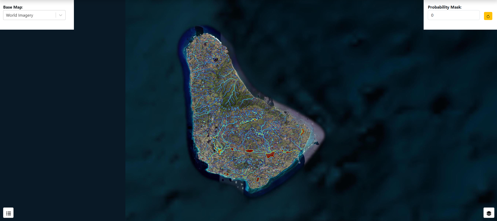
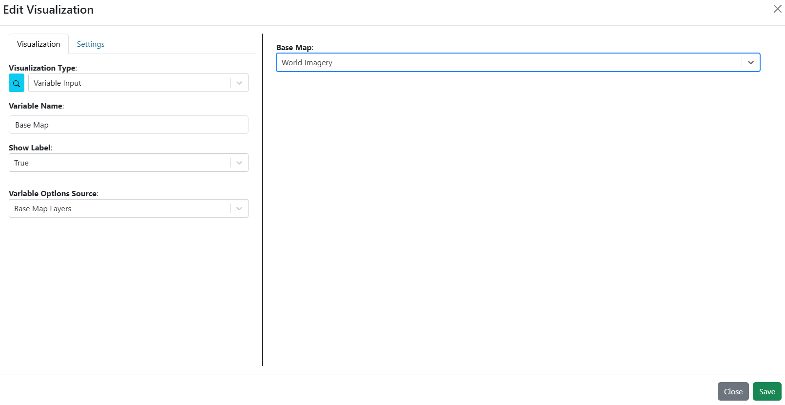
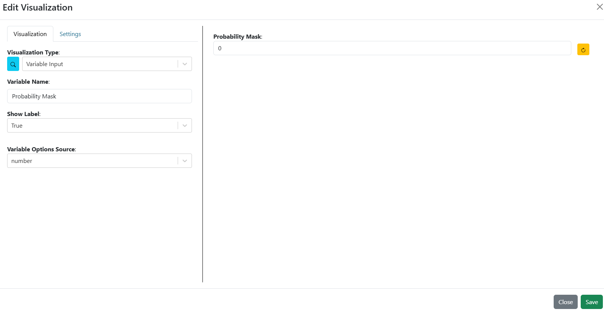
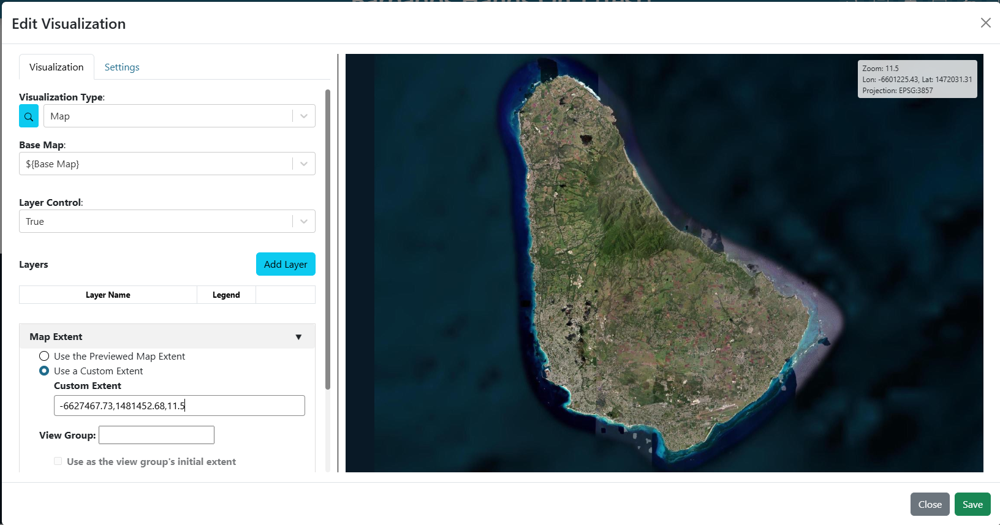
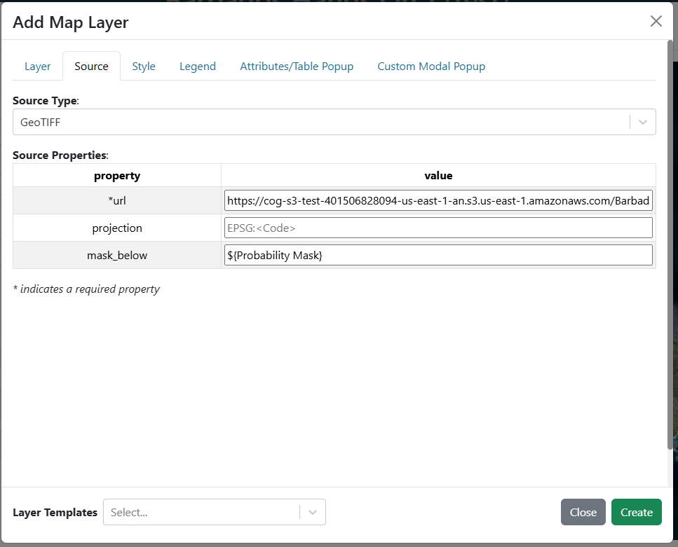
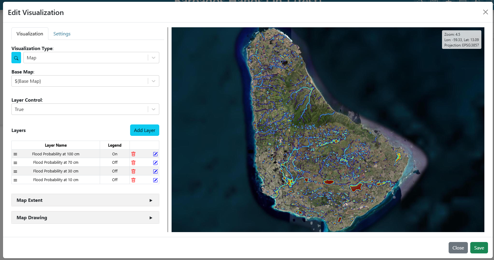
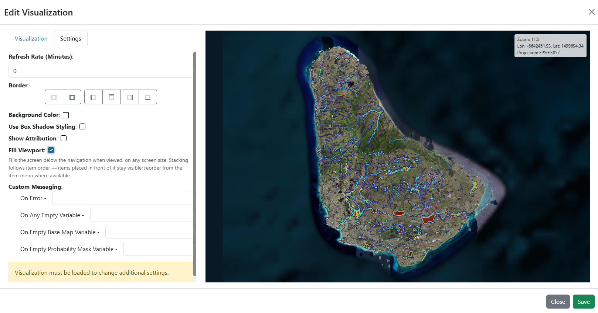

.. Barbados hands-on exercise 1 solution, English. Adapted from the Comoros
.. guide at ../Comoros/exercise_1.rst. Barbados needs no commune-style selector
.. here: the eleven parish products are mosaicked onto one island grid.
.. The built dashboard is dashboards/Barbados/Barbados_Hands_On_1.json.

==============================================================
Exercise 1 — A flood probability map
==============================================================

Building **Barbados Hands On 1** step by step.

.. contents:: On this page
   :depth: 2
   :local:
   :backlinks: none

What you are building
=====================

One map filling the window, carrying the four exceedance-probability rasters of
the forecast cycle, and two controls: a dropdown that switches the base map, and
a number that sets how much probability a cell needs before it is drawn at all.
The whole island is on one grid, so there is nothing to select but the map and
the mask.

   **Screenshot:** the finished dashboard, layer control open so all four layers
   are visible, with both controls along the top.

This exercise is about raster layers: where the URL goes, and how one variable input can drive
the same setting on four layers at once.

The event
=========

Everything here comes from one forecast cycle of the TITO chain for **Hurricane
Tomas**, which crossed Barbados on 29–30 October 2010. Of the twenty historical
hindcasts available for the island it is the one that verifies against the
Grantley Adams gauge — 270 mm simulated against 294 mm observed — and 98 percent
of its rain falls on 30 October. The cycle is therefore **30 October 2010
00:00 UTC with a 24 h horizon**.

Rainfall enters as **50 StormLab members**: member 1 the unperturbed hindcast,
members 2 to 50 perturbations of it. No hydraulic model runs when a storm
approaches. Each parish has a library of 200 synthetic storms with precomputed
maximum-depth maps, each member's rainfall total selects the closest library
storm, and the probability of exceeding a depth at a cell is the share of the 50
members whose matched storm floods that cell that deeply.

All eleven parishes came out **HIGH** on the Flood Risk Matrix for this cycle.

The data
========

Everything comes from one public bucket:

.. code-block:: text

   https://cog-s3-test-401506828094-us-east-1-an.s3.us-east-1.amazonaws.com

.. list-table::
   :header-rows: 1
   :widths: 30 70

   * - Prefix
     - Contents
   * - ``Barbados_training/Barbados_Tomas_2010_flood_maps_for_IBF/``
     - The cycle. ``03_fim_island_mosaic/`` holds the four rasters this exercise
       draws; ``04_ibf_island_deduplicated/`` the receptor geopackage exercise 3
       reads; ``05_reference/`` parish boundaries and enumeration districts.
   * - ``Barbados_IBF/Barbados/``
     - The scenario stores, one Zarr per parish
       (``fim_store_BB01_ChristChurch_v1.zarr`` … ``BB11_SaintThomas``), each
       holding 200 storms of maximum depth. Exercise 2 opens one.

Step 1 — Create the dashboard
=============================

#. Create a new dashboard (see
   `Creating a dashboard <getting_started.rst#creating-a-dashboard>`_) with:

   * **Name**: ``Barbados Hands On 1``
   * **Description**: ``Solution for WMO Barbados Hands On Exercise #1``

#. Find your dashboard on the landing page and double-click it to open.

Step 2 — Add the two variable inputs
====================================

Build both before the layers, because the layers refer to one of them by name.

**The base map selector**

#. click **Edit Dashboard** in the top right to enter edit mode.

#. Click the existing item's 3-dot menu, select **Edit**, and set the
   **Visualization Type** to **Variable Input** (in the **Default** group).

#. Fill in:

   .. list-table::
      :header-rows: 1
      :widths: 32 68

      * - Argument
        - Value
      * - ``variable_name``
        - ``Base Map``
      * - ``show_label``
        - ``True``
      * - ``variable_options_source``
        - ``Base Map Layers``

#. On the **Settings** tab, set **Background Color** to ``#ffffff``.

#. Pick **World Imagery** as the initial value

#. Save the item

#. Resize the item to be a short dropdown along the top left.

   **Screenshot:** the **Variable Input** arguments for the base map selector.

**The probability mask**

#. Click on **Add Dashboard Item** in the top right.

#. Click on the new item's its 3-dot menu, select **Edit**

#. Set the **Visualization Type** to **Variable Input** again.

#. Fill in

   .. list-table::
      :header-rows: 1
      :widths: 32 68

      * - Argument
        - Value
      * - ``variable_name``
        - ``Probability Mask``
      * - ``show_label``
        - ``True``
      * - ``variable_options_source``
        - ``number``

#. On the **Settings** tab, set **Background Color** to ``#ffffff``.

#. Set the initial value to ``0.0`` — "draw every cell with any chance at all"

#. Save the item

#. Drag the item to the far right of the top row and resize it.

   **Screenshot:** the **Variable Input** arguments for the probability mask.

Step 3 — Add the map
====================

#. Click on **Add Dashboard Item** in the top right.

#. Click on the new item's its 3-dot menu, select **Edit**

#. Set the **Visualization Type** to **Map** (in the **Default** group).

#. In the **Base Map** argument, choose ``Base Map`` from the **Variable
   Inputs** section at the bottom of the dropdown. The value becomes
   ``${Base Map}``.

#. Turn **Layer Control** on, so the four layers can be toggled individually.

#. In the **Map Extent** argument, choose **Use a Custom Extent** and enter:

   .. code-block:: text

      -6627467.73,1481452.68,11.5

   That is ``centre-x,centre-y,zoom`` in EPSG:3857 metres. The island is about
   26 km across, so it fits at zoom 11.5.

   **Screenshot:** the **Map** arguments, **Base Map** bound and **Layer
   Control** on.

Step 4 — Add the four probability layers
========================================

These four are identical except for the URL and the name, so build one and
repeat. Add them in this order, so the deepest threshold ends up lowest in the
stack and the shallowest — which covers the largest area — ends up on top.

All four paths share one prefix; only the depth in the filename changes:

.. code-block:: text

   https://cog-s3-test-401506828094-us-east-1-an.s3.us-east-1.amazonaws.com/Barbados_training/Barbados_Tomas_2010_flood_maps_for_IBF/03_fim_island_mosaic/

.. list-table::
   :header-rows: 1
   :widths: 40 60

   * - Layer **Name**
     - filename, appended to the prefix above
   * - ``Flood Probability at 100 cm``
     - ``prob_depth_ge_100cm.20101030.000000.tif``
   * - ``Flood Probability at 70 cm``
     - ``prob_depth_ge_70cm.20101030.000000.tif``
   * - ``Flood Probability at 30 cm``
     - ``prob_depth_ge_30cm.20101030.000000.tif``
   * - ``Flood Probability at 10 cm``
     - ``prob_depth_ge_10cm.20101030.000000.tif``

For **each** of the four:

#. Next to **Layers**, click **Add Layer**.

#. On the **Layer** tab, set:

   .. list-table::
      :header-rows: 1
      :widths: 24 76

      * - Field
        - Value
      * - ``name``
        - *see the table above*
      * - ``opacity``
        - ``.5``

#. On the **Source** tab, set **Source Type** to **GeoTIFF** and fill in:

   .. list-table::
      :header-rows: 1
      :widths: 24 76

      * - Field
        - Value
      * - ``url``
        - *see the table above - make sure to use the full URL*
      * - ``mask_below``
        - ``${Probability Mask}``

   ``mask_below`` hides cells at or below the value given, and binding it to the
   variable input is what makes this dashboard interactive. Type the reference by
   hand: it is a free-text field, so it takes the ``${Variable Name}`` form
   rather than offering a dropdown, and the name inside the braces must match
   ``Probability Mask`` exactly.

#. **On the 100 cm layer only**, go to the **Legend** tab and select **Default
   Legend**. The four share a scale, so four identical colour bars would just
   take up room.

#. Save the layer by clicking **Create**.

   **Screenshot:** the **Source** tab with **Source Type** GeoTIFF, one
   probability URL, and ``mask_below`` bound to ``${Probability Mask}``.

   **Screenshot:** the **Layers** list with all four layers, deepest first.

Step 5 — Finish the map, then use the mask
==========================================

#. On the **Settings** tab, turn on **Fill Viewport**.

#. Save the item and resize the map to fill the window

#. if it covers the two inputs then click on the 3 dot menu and use **Order → Send to Back**.

#. Save the dashboard.

   **Screenshot:** the **Settings** tab with **Fill Viewport** on.

Now raise **Probability Mask** from ``0`` and watch all four layers thin out
together:

.. list-table::
   :header-rows: 1
   :widths: 20 80

   * - Mask
     - What is left on the map
   * - ``0``
     - Every cell any member floods to that depth.
   * - ``0.2``
     - Only cells where more than 10 of the 50 members reached that depth.
   * - ``0.5``
     - Only cells more than half the members agree on.
   * - ``0.9``
     - The handful of cells almost every member floods.

One input, four layers: nothing in the layers knows about the others, they all
just declare a dependency on the same name.

Checkpoint
==========

You should now have:

* A map filling the window, showing Barbados over your chosen base map.
* A layer control listing five layers (including the base map).
* A legend control with one colour bar, on the 100 cm layer.
* A base-map dropdown and a **Probability Mask** number along the top.
* Raising the mask thinning all four layers at once.
* The 10 cm layer covering a visibly larger footprint than the 100 cm one —
  roughly 79,800 cells against 10,400, with the deeper layers tinting through it
  rather than being hidden by it.

Talking points
==============

* **One variable, four consumers.** ``${Probability Mask}`` appears in four
  separate layer sources. None of them knows about the others.
* **Layer order is draw order, and the thresholds are nested.** The first layer
  in the list draws lowest and each later one paints over it, so the 10 cm layer
  — added last, largest footprint — sits on top. Anywhere the 100 cm layer has a
  value the 10 cm layer has one too, so at full opacity the three deeper layers
  would be invisible. The ``.5`` opacity is what keeps the nesting readable; the
  layer control is still the way to isolate one threshold.
* **What the mask actually filters.** Raising it to 0.2 does not keep "cells with
  a 20% chance of flooding". It keeps cells where **more than 10 of the
  forecast's 50 members** reached that depth. That is an ensemble share for this
  cycle, not a calibrated probability and not a frequency over time.

Next
====

`Exercise 2 — Depth for a single storm <exercise_2.rst>`_ opens a parish's
flood-map library and puts the storm on a variable input.
