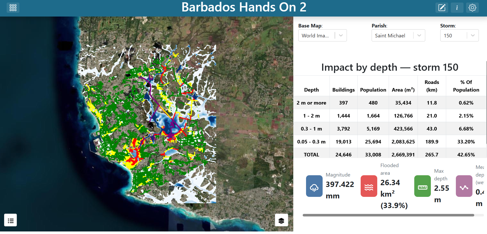
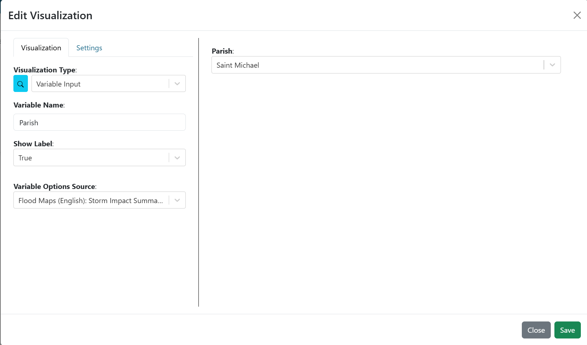
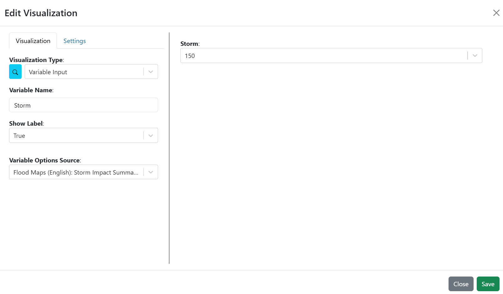
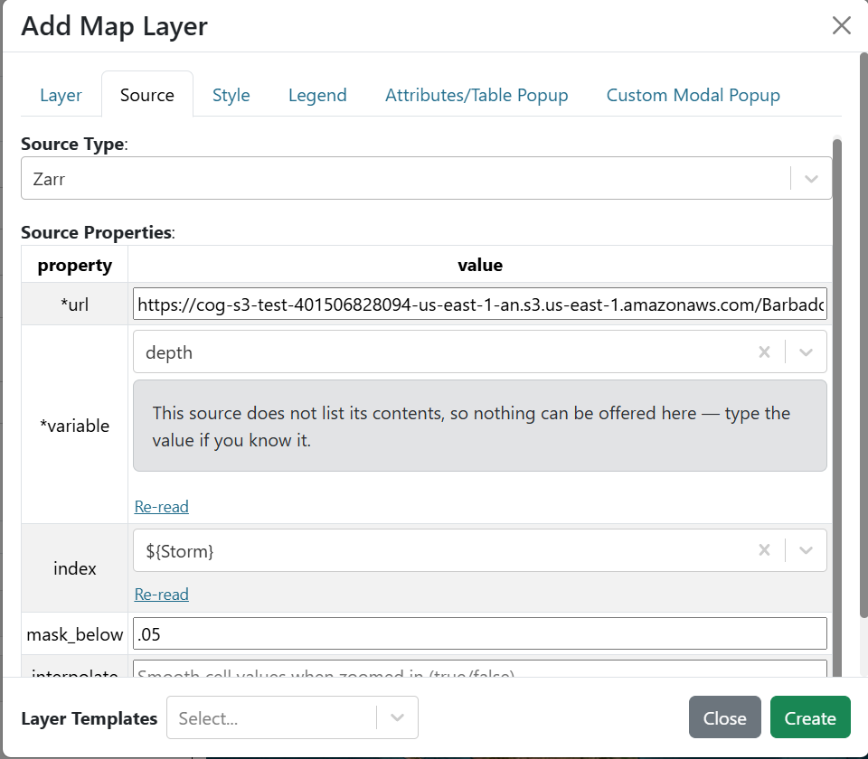
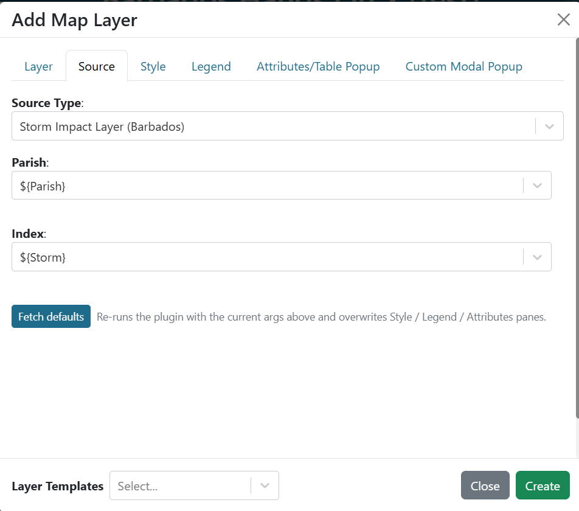
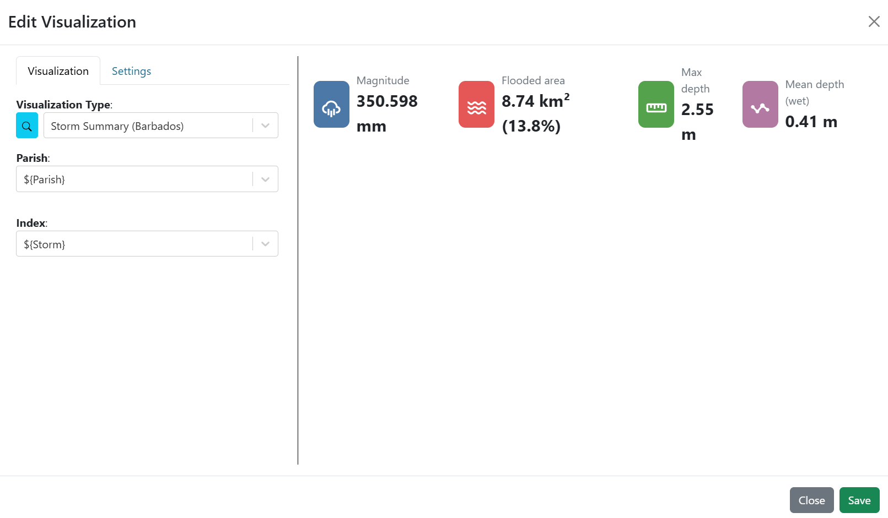

.. Barbados hands-on exercise 2 solution, English. The impact layer, table and
.. card run against the full island receptor set -- all 204,727 building
.. footprints and 22,509 road segments -- regenerated from the IBF pipeline, so
.. the counts are real exposure for the selected parish, with no severity filter
.. standing between the receptor list and the answer.
.. The built dashboard is dashboards/Barbados/Barbados_Hands_On_2.json.

==============================================================
Exercise 2 — Depth for a single storm
==============================================================

Building **Barbados Hands On 2** step by step.

.. contents:: On this page
   :depth: 2
   :local:
   :backlinks: none

What you are building
=====================

A map on the left showing one storm's flood depth and the buildings and roads it
floods, and on the right a summary table and a headline card. Three controls
along the top pick the base map, the parish and the storm, and everything
re-computes.

   **Screenshot:** the finished dashboard, depth for storm 150 in Saint Michael,
   with the three selectors, map, summary table and card.

New ideas here: reading a slice out of a Zarr store, a vector layer whose
features are produced by a plugin rather than fetched from a URL, and two
variable inputs doing different jobs in the same source — one picks the **file**,
the other picks the **slice inside it**.

Exercise 1 drew **probabilities** across a whole forecast. This draws **depth**
in one specific scenario — a physical quantity, so it needs no threshold to
interpret.

**What the counts are counts of.** The receptor file behind this exercise is the
**full island stock**: 204,727 building footprints and 22,509 road segments
across all eleven parishes, carrying census-derived population. Nothing is
filtered out by severity, so a count here is exposure in the ordinary sense —
"this many buildings on Barbados flood in this scenario" — and it stays true at
the wet end of the library, where a scenario floods well beyond the footprint of
Tomas itself.

One caveat worth keeping: the table counts receptors, so a large building and a
small one weigh the same. The population and area columns are there to give that
the scale the building count on its own does not.

The flood-map libraries
=======================

Each parish has its own Zarr store under ``Barbados_IBF/Barbados/``:

.. code-block:: text

   fim_store_BB01_ChristChurch_v1.zarr   fim_store_BB07_SaintLucy_v1.zarr
   fim_store_BB02_SaintAndrew_v1.zarr    fim_store_BB08_SaintMichael_v1.zarr
   fim_store_BB03_SaintGeorge_v1.zarr    fim_store_BB09_SaintPeter_v1.zarr
   fim_store_BB04_SaintJames_v1.zarr     fim_store_BB10_SaintPhilip_v1.zarr
   fim_store_BB05_SaintJohn_v1.zarr      fim_store_BB11_SaintThomas_v1.zarr
   fim_store_BB06_SaintJoseph_v1.zarr

All eleven are published. Each holds 200 scenarios of maximum depth, clipped to
the parish, on the parish's own window — Saint Michael is 308 × 271 cells.

Two properties of the depth array to know before you present it:

* **Depth saturates at 2.55 m.** It was stored upstream as whole centimetres in a
  byte, so a cell reading 2.55 means *at least* 2.55, and no band above about 2 m
  is distinct from the one below it.
* **The scenarios are sorted by magnitude**, so stepping through the positions
  walks severity. The magnitude itself is the area-weighted mean of the scenario's
  rain over the parish — real RainyDay totals, not placeholders.

Step 1 — Create the dashboard
=============================

#. Create a new dashboard with:

   * **Name**: ``Barbados Hands On 2``
   * **Description**: ``Solution for WMO Barbados Hands On Exercise #2``

#. Find your dashboard on the landing page and double-click it to open.

Step 2 — Add the three variable inputs
======================================

**The base map selector** 

#. click **Edit Dashboard** in the top right to enter edit mode.

#. Click the existing item's 3-dot menu, select **Edit**, and set the
   **Visualization Type** to **Variable Input** (in the **Default** group).

#. Fill in:

   .. list-table::
      :header-rows: 1
      :widths: 32 68

      * - Argument
        - Value
      * - ``variable_name``
        - ``Base Map``
      * - ``show_label``
        - ``True``
      * - ``variable_options_source``
        - ``Base Map Layers``

#. On the **Settings** tab, set **Background Color** to ``#ffffff``.

#. Pick **World Imagery** as the initial value

#. Save the item

#. Resize the item to be a short dropdown along the top left.

.. figure:: images/ex1-variable-input-basemap.png
   :alt: The base map variable input configuration
   :width: 100%

   **Screenshot:** the **Variable Input** arguments for the base map selector.

**The parish selector**

#. Click on **Add Dashboard Item** in the top right.

#. Click on the new item's its 3-dot menu, select **Edit**

#. Set the **Visualization Type** to **Variable Input**, and fill in:

   .. list-table::
      :header-rows: 1
      :widths: 32 68

      * - Argument
        - Value
      * - ``variable_name``
        - ``Parish``
      * - ``show_label``
        - ``True``
      * - ``variable_options_source``
        - ``Flood Maps (English): Storm Impact Summary (Barbados) - Parish``
   
   The variable options source is generated from an existing plugin argument, in the
   form ``<group>: <plugin label> - <Argument>``. Picking it means "offer the same 
   choices the impact summary's ``parish`` argument offers", so the control is populated form the plugin.

#. Background ``#ffffff``, initial value ``Saint Michael`` — the most populous
   parish, and where most of the exposure is. Drag it beside the base map.

   **Screenshot:** the **Variable Input** arguments for the parish selector.

**The storm selector**

#. Click on **Add Dashboard Item** in the top right.

#. Click on the new item's its 3-dot menu, select **Edit**

#. Set the **Visualization Type** to **Variable Input**, and fill in:

   .. list-table::
      :header-rows: 1
      :widths: 32 68

      * - Argument
        - Value
      * - ``variable_name``
        - ``Storm``
      * - ``show_label``
        - ``True``
      * - ``variable_options_source``
        - ``Flood Maps (English): Storm Impact Summary (Barbados) - Index``

   That options source is generated from an existing plugin argument, in the
   form ``<group>: <plugin label> - <Argument>``. Picking it means "offer the
   same choices the impact summary's ``index`` argument offers", so the control
   is populated from the plugin.

#. Set the initial value to ``150``.

#. Background ``#ffffff``, and drag it to the far right of the top row.

   **Screenshot:** the **Variable Input** arguments for the storm selector.

Step 3 — Add the map with the Zarr depth layer
==============================================

#. Click on **Add Dashboard Item** in the top right.

#. Click on the new item's its 3-dot menu, select **Edit**

#. Set the **Visualization Type** to **Map** (under the **Default** section).

#. Bind **Base Map** to ``${Base Map}`` and turn **Layer Control** on.

#. In the **Map Extent** argument, choose **Use a Custom Extent** and enter:

   .. code-block:: text

      -6634889.03,1473048.86,13

   That is ``centre-x,centre-y,zoom`` in EPSG:3857 metres, centred on Saint
   Michael. A parish window is only a few kilometres across, so the zoom is
   tighter than exercise 1's island view.

#. Next to **Layers**, click **Add Layer**, and on the **Layer** tab set
   ``name`` to ``Flood Depth (m), parish library``.

#. On the **Source** tab, set **Source Type** to **Zarr** and fill in:

   .. list-table::
      :header-rows: 1
      :widths: 24 76

      * - Field
        - Value
      * - ``url``
        - ``https://cog-s3-test-401506828094-us-east-1-an.s3.us-east-1.amazonaws.com/Barbados_IBF/Barbados/fim_store_${Parish}_v1.zarr``
      * - ``variable``
        - ``depth``
      * - ``index``
        - ``${Storm}``
      * - ``mask_below``
        - ``0.05``

   Two variables in one source, doing different jobs. ``${Parish}`` is spliced
   into the URL, so changing it opens a **different store**. ``${Storm}`` is the
   whole ``index`` field, so changing it reads a **different slice** of the store
   already open. The store holds all 200 scenarios in one array and ``index``
   selects one — no duplicated layers, no separate files, and only one scenario's
   worth of data crosses the wire.

   ``mask_below`` is ``0.05`` because that is the store's own

#. On the **Style** tab, leave the mode on **Continuous** and pick the **Blues**
   ramp (under **Single hue**). Leave **Min** and **Max** empty.

   Empty bounds mean "resolve them from the data at render time", so the ramp
   re-stretches for each scenario as the storm changes.

#. On the **Legend** tab, select **Default Legend**

#. Click **Create**.

   **Screenshot:** the **Source** tab with **Source Type** Zarr, the store URL
   carrying ``${Parish}``, ``variable`` depth, ``index`` ``${Storm}`` and
   ``mask_below`` 0.05.

Step 4 — Add the plugin-backed impact layer
===========================================

This layer's features are computed per request by a plugin. There is no GeoJSON
URL — the plugin samples the storm's depth onto every receptor in the parish and
returns the result.

#. Next to **Layers**, click **Add Layer** again.

#. Go straight to the **Source** tab and set **Source Type** to
   **Storm Impact Layer (Barbados)**. Dynamic map-layer plugins appear in the
   same **Source Type** dropdown as GeoTIFF and Zarr, under their plugin group.

#. Fill in:

   .. list-table::
      :header-rows: 1
      :widths: 24 76

      * - Argument
        - Value
      * - ``parish``
        - ``${Parish}``
      * - ``index``
        - ``${Storm}``

   The same two variables the depth layer uses, so the raster and the features
   always describe the same parish and the same scenario.

#. Click **Fetch plugin defaults**. The layer arrives named **Flooded buildings
   and roads**, with eight style rules on the ``band`` attribute and a four-item
   **Depth** legend.

   Look at the rules: four match **polygon** geometry for the buildings and four
   match **linestring** for the roads. Fetching the defaults is what gets that
   pairing right — a rule whose geometry type does not match its features leaves
   them grey.

#. On the **Layer** tab, turn on **Render as Image**. The layer is then drawn to
   a single canvas and re-blitted while you pan, instead of every footprint being
   re-styled and re-drawn each frame. With thousands of buildings on screen that
   is the difference between choppy and smooth. The cost is a slight blur mid-
   zoom that sharpens when the view settles, and approximate hit-detection when
   you click a feature.

#. Save the layer by clicking **Create**.

#. Save the map and resize it to fill roughly the left 60% of the window, leaving
   the right-hand strip for the table and the card.

   **Screenshot:** the **Source** tab with **Storm Impact Layer (Barbados)**
   selected, ``parish`` and ``index`` bound, and **Fetch plugin defaults**.

Step 5 — Add the summary table and the card
===========================================

#. Click on **Add Dashboard Item** in the top right.

#. Click on the new item's its 3-dot menu, select **Edit**

#. Set the **Visualization Type** to **Storm Impact Summary (Barbados)** (in the
   **Flood Maps (English)** group).

#. Bind ``parish`` to ``${Parish}`` and ``index`` to ``${Storm}``.

   The table breaks the scenario's flooded receptors into depth bands, deepest
   first, with counts of buildings, population, area and road length, and the
   share of the **parish's** population — which is why the parish has to reach
   the plugin as an argument rather than being baked in.

#. Save the item and drag it to the right of the dashboard.

#. Click on **Add Dashboard Item** in the top right.

#. Click on the new item's its 3-dot menu, select **Edit**

#. Set the **Visualization Type** to **Storm Summary (Barbados)**, binding the same two arguments.

   The card gives the headline figures — the scenario's rainfall total over the
   parish, the flooded area, the deepest water and the mean depth where wet — for
   someone who will not read a table.

#. Save the item, drag it below the table, and save the dashboard.

   **Screenshot:** the summary table and card for one scenario.

Step 6 — Test the wiring
========================

Change the **Storm** number. All four items update: the depth layer re-reads its
slice, the impact layer re-runs, and the table and card re-fetch. Progress
messages appear while the impact layer recomputes, and the colour bar re-scales
to the new scenario's range. Try 1, 50, 100, 150 and 199 in turn to
see the flooded footprint grow — and to notice that it does not grow
monotonically. The library is sorted by parish-mean rainfall total, but the
flooded footprint depends on *where* in the parish the rain fell, so a larger
total does not guarantee more water in any given place.

Then change the **Parish**. The depth layer opens a different store entirely, and
the plugins read a different set of receptors against a different population.
Only the camera stays put.

Worth doing once with the numbers in view: at Saint Michael, scenario 150 floods
**24,646** of the parish's **60,062** buildings — 41 percent of them, holding
33,008 people. That scenario is 397 mm against Tomas's 229 mm island mean, so it
is a considerably wetter event than the one the historical maps describe, and the
table says so in absolute terms rather than as a share of some smaller subset.

Checkpoint
==========

You should now have:

* A map on the left with the base map, a depth layer and an impact layer.
* Three selectors along the top: base map, parish and storm.
* Depth drawn in blue, re-scaling as the storm changes.
* Buildings drawn as coloured **footprints** and roads as coloured lines, with a
  four-band **Depth** legend.
* A summary table and a card on the right, both updating with either selector.
* Changing the parish swapping the store, the receptors and the population the
  share is measured against — with the view staying put.

Talking points
==============

* **Splicing versus substituting.** ``${Storm}`` is a whole field, so it resolves
  to a value with its type intact. ``${Parish}`` sits inside a longer URL, so it
  is spliced into the surrounding text. Same syntax, different behaviour, and it
  is what lets one layer reach eleven different stores.
* **Magnitude orders the library; it does not order the impact.** Stepping the
  storm is the fastest way to show that, and it is why the forecast matches a
  member to a storm by total and then reads the impact off the depth map, never
  off the magnitude.
* **Know what the table counts.** The receptor file is the full island stock, so
  the table answers "how many buildings on Barbados does this scenario flood" —
  an absolute exposure figure, and a fair comparison across scenarios.
* **One variable pair, four consumers.** ``${Parish}`` and ``${Storm}`` reach a
  Zarr source, a plugin layer argument and two visualization arguments. Nothing
  in the four items knows about the others; they all declare a dependency on a
  name.

Next
====

`Exercise 3 — Hazard classification with adjustable thresholds <exercise_3.rst>`_
turns the probability thresholds themselves over to the viewer, and brings in the
receptor file for the cycle it actually belongs to.
