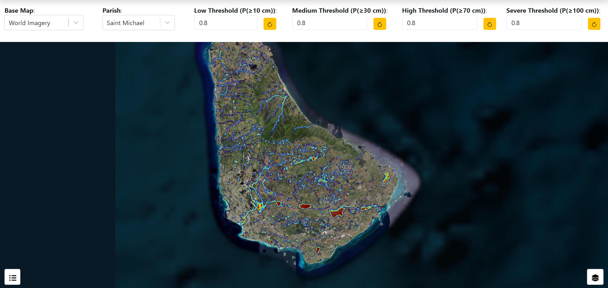
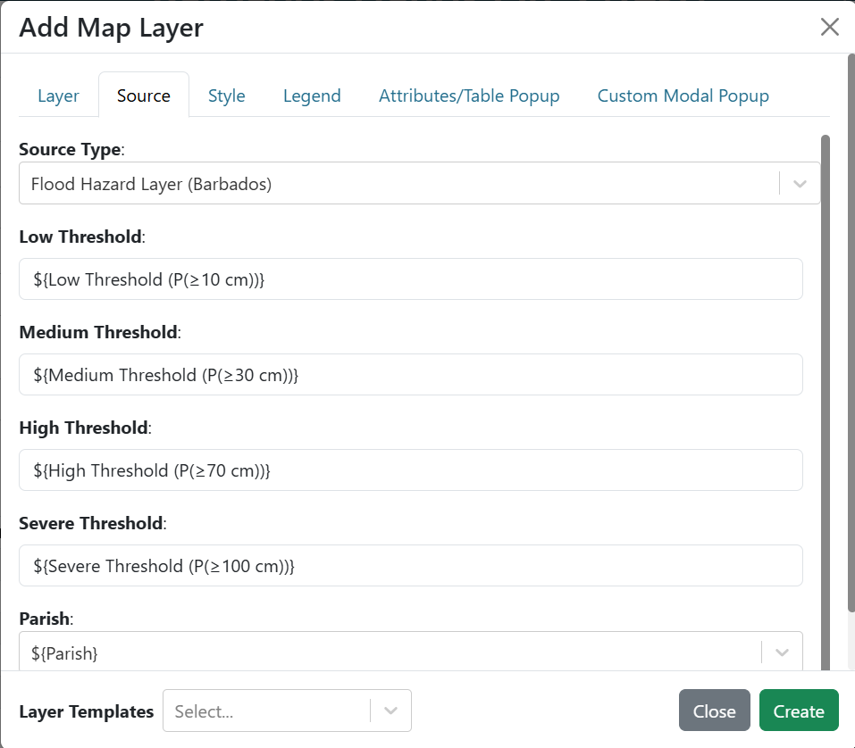
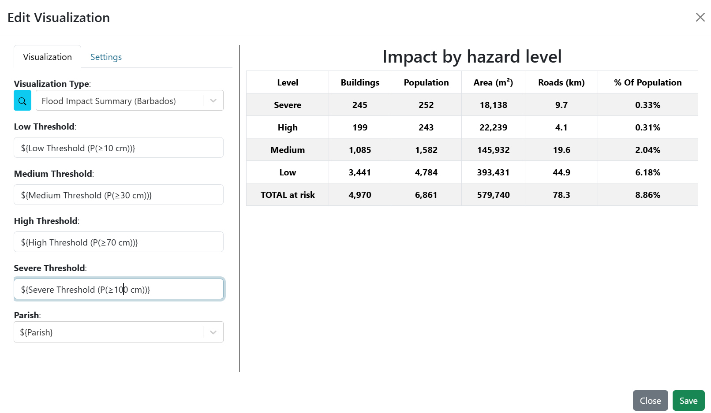
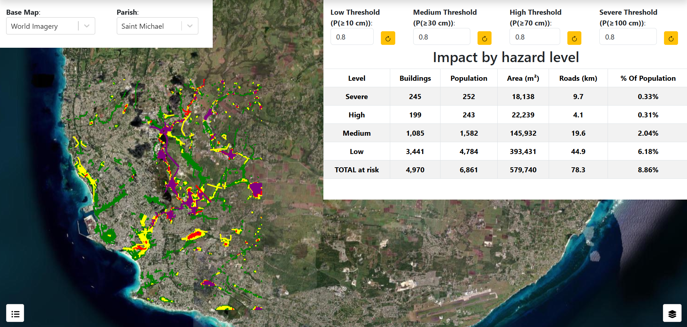
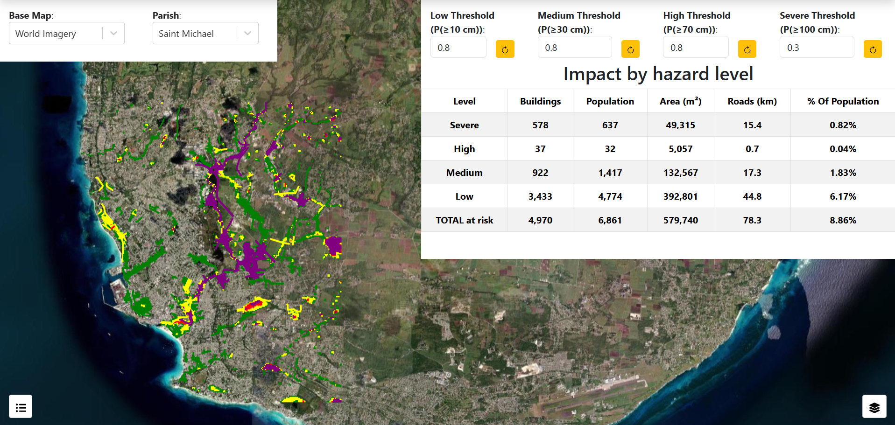

.. Barbados hands-on exercise 3 solution, English. Adapted from the Comoros
.. guide at ../Comoros/exercise_3.rst, and scoped by parish the same way that
.. one is scoped by commune: the three plugins take a parish argument and read
.. that parish's own product. Receptors are the full island stock as footprints,
.. sampled as footprints and drawn as points, so the impact layer sets
.. buildings_as_points and emits point rules to match.
.. The built dashboard is dashboards/Barbados/Barbados_Hands_On_3.json.

==============================================================
Exercise 3 — Hazard classification with adjustable thresholds
==============================================================

Building **Barbados Hands On 3** step by step.

**Start here** — This exercise reuses the four probability layers from
`Exercise 1 <exercise_1.rst>`_, so building that one first will save you time.

.. contents:: On this page
   :depth: 2
   :local:
   :backlinks: none

What you are building
=====================

A full-window map carrying the four probability rasters from exercise 1 plus two
computed layers: a hazard classification and the buildings and roads that fall
inside it. Four number inputs across the top set the probability threshold for
each hazard level, and an impact table sits under them. Change a threshold and
the classification, the affected features and the table all recompute.

.. figure:: images/ex3-finished.png
   :alt: The finished exercise 3 dashboard
   :width: 100%

   **Screenshot:** the finished dashboard — full-window map, four threshold
   inputs along the top, impact table on the right.

Understanding the four thresholds
=================================

Each hazard level is tied to **one** depth threshold and has its **own**
probability gate:

.. list-table::
   :header-rows: 1
   :widths: 18 32 25 25

   * - Level
     - Driven by
     - Colour
     - Default gate
   * - Low
     - P(≥ 10 cm)
     - green
     - 0.8
   * - Medium
     - P(≥ 30 cm)
     - yellow
     - 0.8
   * - High
     - P(≥ 70 cm)
     - red
     - 0.8
   * - Severe
     - P(≥ 100 cm)
     - purple
     - 0.8

A cell takes the level of the **deepest** threshold whose gate it clears.

**Note** — All four gates can sit at 0.8. Every Barbados layer reaches 1.0
somewhere, so the Severe class is reachable at any threshold — unlike Guatemala,
whose 76 cm raster only ever holds 0 or 0.2 and whose Severe gate has to be
dropped to 0.2 before the colour can appear at all. Check what range a layer can
actually reach before you expose a control for it.

What the receptor file is, and is not
=====================================

The two computed layers and the table read
``04_ibf_island_deduplicated/barbados_ibf_receptors_full…gpkg``, filtered to the
parish you select. Three things about it shape what you can say:

* **It is the full island stock** — 204,727 buildings and 22,509 road segments,
  across all eleven parishes, with nothing removed by severity. A count from it
  is exposure for Barbados, not exposure within a subset something else already
  flagged.
* **Each receptor appears once.** The run writes per-parish impact folders, but
  those windows are parish-plus-buffer and overlap, so a receptor near a boundary
  appears in up to five of them. This file keeps each once, from the window of
  its own parish, matching the published per-parish counts exactly — which is
  also what makes filtering on ``ADM1_PCODE`` give a clean parish count.
* **Buildings are footprints**, so a building is classified on the maximum
  probability over its own outline, and one that spans several cells picks up the
  worst of them. The layer then *draws* each as a single point: the classification
  is the footprint's, the marker is just where to put it.

The share in the table's last column is against the **selected parish's**
population — 77,395 for Saint Michael — not the island's 269,090. Changing the
parish changes the denominator as well as the numerator, which is worth pointing
out explicitly the first time someone watches the percentage jump.

Step 1 — Create the dashboard
=============================

#. Create a new dashboard with:

   * **Name**: ``Barbados Hands On 3``
   * **Description**: ``Solution for WMO Barbados Hands On Exercise #3``

#. Open it, turn on **Unrestricted Grid Item Movement**, and click **Edit
   Dashboard**.

Step 2 — Add the base map selector
==================================

As in exercise 1 — ``variable_name`` ``Base Map``, ``show_label`` ``True``,
``variable_options_source`` ``Base Map Layers``, background ``#ffffff``, initial
value **World Imagery**. Drag it to the top-left. If you built exercise 1, the
quickest route is **Export** on its 3-dot menu and **Import Dashboard Item**
here.

Step 3 — Add the parish selector
================================

All three plugins in this exercise work one parish at a time, so they need a
parish to work on. This is the same selector exercise 2 uses, so **Export** it
from that dashboard's 3-dot menu and **Import Dashboard Item** here if you built
it.

Otherwise add a **Variable Input** with:

.. list-table::
   :header-rows: 1
   :widths: 40 60

   * - Field
     - Value
   * - ``variable_name``
     - ``Parish``
   * - ``show_label``
     - ``True``
   * - ``variable_options_source``
     - ``dropdown``
   * - ``initial_value``
     - ``BB08_SaintMichael``

The eleven choices pair a value with a label: ``BB01_ChristChurch`` →
*Christ Church*, ``BB02_SaintAndrew`` → *Saint Andrew*, and so on through
``BB11_SaintThomas``. The value is what the plugins receive; they take the
``BB08`` half to filter receptors and the ``SaintMichael`` half to build the
raster path.

Drag it onto the top row, to the right of the base map selector.

Step 4 — Add the four threshold inputs
======================================

Build all four before the layers that consume them. Each is a **Variable Input**
with ``variable_options_source`` set to ``number``:

.. list-table::
   :header-rows: 1
   :widths: 100

   * - ``variable_name``
   * - ``Low Threshold (P(≥10 cm))``
   * - ``Medium Threshold (P(≥30 cm))``
   * - ``High Threshold (P(≥70 cm))``
   * - ``Severe Threshold (P(≥100 cm))``

For **each** of the four:

#. Add a dashboard item, set the **Visualization Type** to **Variable Input**,
   and fill in ``variable_name`` from the table, ``show_label`` ``True``,
   ``variable_options_source`` ``number``.

#. On the **Settings** tab, set **Background Color** to ``#ffffff`` and add a
   top border, changing its style to ``solid`` so it shows. Give the leftmost
   input a left border and the rightmost a right border, so the four read as one
   strip.

#. Set the initial value to ``0.8``.

#. Save, and drag it into place along the top of the dashboard.

The names carry the depth they gate because the plugin argument they bind to is
called only ``low_threshold``. Without the depth in the variable name, nothing on
the dashboard says which threshold does what.

   **Screenshot:** the four threshold inputs side by side.

Step 5 — Add the map and the four probability rasters
=====================================================

If you have exercise 1, reuse its map:

#. Open the exercise 1 dashboard, **Export** the map item, and **Import
   Dashboard Item** here.

#. Edit the map item. For each of the four rasters, open the layer and turn off
   **Default Visibility** on the **Layer** tab, so the classification is what
   shows on load and the rasters are there to switch on for comparison.

#. On each raster's **Source** tab, set ``mask_below`` back to ``0``. Exercise 1
   bound it to a ``Probability Mask`` input that does not exist here — the
   thresholds do that filtering now — and an unresolved variable leaves the field
   empty.

#. If the map covers the inputs, use **Order → Send to Back**.

If you do not have exercise 1, build the map and the four rasters from scratch as
described there, then carry on.

These four stay on the **island mosaic**, while the two computed layers below
read the selected parish's own window. That is deliberate: the rasters are
context, they are GPU-drawn and cost nothing to leave island-wide, and inside a
parish the mosaic and that parish's window agree — the mosaic was built from
them. They differ only in the buffer fringe each window carries past its parish
boundary, which is also why the classification shading runs a little wider than
the parish while the counts do not: receptors are filtered on ``ADM1_PCODE``.

Step 6 — Add the hazard classification layer
============================================

#. In edit mode, open the map item's 3-dot menu and select **Edit**.

#. Next to **Layers**, click **Add Layer**, and go straight to the **Source**
   tab.

#. Set **Source Type** to **Flood Hazard Layer (Barbados)**.

#. Fill in the plugin's five arguments — the four gates and the parish:

   .. list-table::
      :header-rows: 1
      :widths: 30 70

      * - Argument
        - Value
      * - ``low_threshold``
        - ``${Low Threshold (P(≥10 cm))}``
      * - ``medium_threshold``
        - ``${Medium Threshold (P(≥30 cm))}``
      * - ``high_threshold``
        - ``${High Threshold (P(≥70 cm))}``
      * - ``severe_threshold``
        - ``${Severe Threshold (P(≥100 cm))}``
      * - ``parish``
        - ``${Parish}``

   The parish argument is what makes this the same shape as the Comoros plugin,
   which takes a commune. Barbados publishes both an island mosaic and the eleven
   per-parish windows the mosaic was built from; this plugin reads the window,
   because that is the product matched on the rainfall for the parish you are
   looking at.

#. Click **Fetch plugin defaults**. The layer is named **Hazard classification**,
   styled with four rules on the ``hazard`` attribute, and given a four-item
   **Hazard** legend.

#. Save the layer by clicking **Create**.

   **Screenshot:** the **Source** tab for the hazard layer, four gates and the
   parish bound to variables.

Step 7 — Add the affected-features layer
========================================

#. Next to **Layers**, click **Add Layer** again.

#. Go straight to the **Source** tab and set **Source Type** to
   **Flood Impact Layer (Barbados)**.

#. Bind the same five arguments to the same five variables as in the previous
   step.

#. Click **Fetch plugin defaults**. The layer arrives as **Buildings and roads at
   risk** with eight rules and a **Hazard** legend.

   Look at the rules: four match **point** geometry for the buildings and four
   match **linestring** for the roads. Fetching the defaults is what gets that
   pairing right — a rule whose geometry type does not match its features never
   fires, and those features stay grey.

#. Save the layer by clicking **Create**.

The two layers answer different questions from the same thresholds: the hazard
layer classifies *ground*, this one classifies *assets*. Keeping them separate
lets a viewer turn off the ground shading and look only at what is affected.

Step 8 — Finish the map
=======================

#. In the **Map Extent** argument, choose **Use a Custom Extent** and enter:

   .. code-block:: text

      -6627467.73,1481452.68,11.5

#. On the **Settings** tab, turn on **Fill Viewport**.

#. Save the item, resize the map to fill the window, and move any threshold input
   you displaced back into place.

#. Save the dashboard.

Step 9 — Add the impact summary table
=====================================

#. Add another item and set the **Visualization Type** to
   **Flood Impact Summary (Barbados)** (in the **Flood Maps (English)** group).

#. Bind the same five arguments to the same five variables as in step 6.

#. On the **Settings** tab, set **Background Color** to ``#ffffff`` and add
   borders on the left, right and bottom, so it joins the strip of threshold
   inputs above it.

#. Save the item and drag it directly below the threshold inputs on the right.

#. Save the dashboard.

   **Screenshot:** the impact summary table arguments bound to the four threshold
   variables and the parish.

Step 10 — Test the wiring
=========================

Change a threshold. The hazard shading, the affected features and the table
should all recompute together, with progress messages while the layers rebuild.

At the default gates, with Saint Michael selected, the table reads **4,970
buildings** and **6,861 people** — 8.86 percent of the parish's 77,395.
Lowering the **Low Threshold** from 0.8 is the clearest demonstration: the green
class spreads as cells that only a minority of members flood start to qualify.

Change the **Parish** as well. Both computed layers and the table reload against
that parish's own rasters and its own population, and the percentage moves for
two reasons at once. Saint Michael is the heaviest parish at 4,970 buildings;
Saint Joseph, which Tomas largely spared, returns 114.

   **Screenshot:** the view before lowering the Low threshold.

   **Screenshot:** the same view after lowering it.

Item positions
==============

.. list-table::
   :header-rows: 1
   :widths: 46 13 13 13 15

   * - Item
     - ``x``
     - ``y``
     - ``w``
     - ``h``
   * - Map
     - 0
     - 0
     - 99
     - 41
   * - Base Map (variable input)
     - 0
     - 0
     - 17
     - 6
   * - Parish (variable input)
     - 17
     - 0
     - 14
     - 6
   * - Low Threshold (variable input)
     - 56
     - 0
     - 11
     - 7
   * - Medium Threshold (variable input)
     - 67
     - 0
     - 12
     - 7
   * - High Threshold (variable input)
     - 79
     - 0
     - 11
     - 7
   * - Severe Threshold (variable input)
     - 90
     - 0
     - 10
     - 7
   * - Flood Impact Summary (table)
     - 56
     - 7
     - 44
     - 21

Checkpoint
==========

You should now have:

* A map filling the window, with seven layers in the layer control (four
  rasters, two computed layers, and the base map).
* The four probability rasters switched off on load, there to compare against.
* Four labelled threshold inputs across the top.
* Buildings drawn as coloured **points** and roads as coloured lines.
* Moving any threshold updating the hazard layer, the impact layer and the
  table together, with progress messages while they rebuild.

Talking points
==============

* **Four gates on four different questions.** "Severe" means P(≥100 cm) ≥ 0.8
  while "High" means P(≥70 cm) ≥ 0.8. Those are different questions at the same
  cutoff, so the level names are not comparable to each other. Setting all four
  equal — as the default does — is the easiest version to explain: the levels
  then differ only by depth.
* **What the gate actually filters.** A threshold of 0.8 keeps cells where more
  than 40 of the forecast's 50 members reached that depth. It is an ensemble
  share for this cycle, not a calibrated probability.
* **Analysed as footprints, drawn as points.** A building takes the worst
  probability found anywhere under its outline — better than sampling one point
  would give — and is then serialised as a single representative point. The
  numbers come from the footprint; only the drawing is simplified.
* **Scope is a performance decision too.** Working a parish at a time is what
  keeps the map responsive: Saint Michael returns 5,583 features where the island
  returned 17,231, and most parishes far fewer. It is also the honest scope — the
  parish rasters are matched on that parish's own rainfall.
* **Vectorising a classification.** A map layer can only point at a URL, and
  nothing serves a computed raster, so the plugin vectorises the classified grid:
  adjacent cells of equal class merge into one polygon, about 1,600 of them for
  Saint Michael at the default gates. Normal and NoData are dropped — most of the grid — because a
  basemap shows unaffected ground better than a coloured layer does.
* **Denominators are a choice.** 8.86 percent is against Saint Michael's 77,395
  people. The same 4,970 buildings would be 1.85 percent of the island's 269,090,
  and a larger share still against only the buildings the forecast flags. The
  parish selector makes this visible: switch parishes and watch both halves of
  the fraction move. Always say which denominator you are using.

Next
====

The three exercises together cover the cycle's probability rasters, the parish
scenario libraries and the classification. The notebooks in
``notebooks/Barbados/`` — when written — will derive the same numbers as plain
Python.
