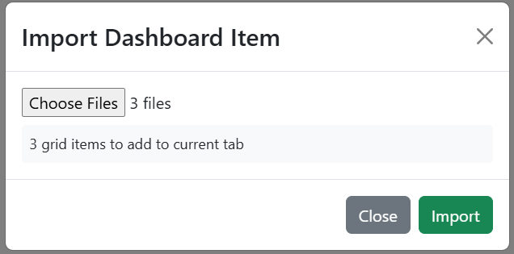

.. Barbados hands-on exercise 3 solution, English. Adapted from the Comoros
.. guide at ../Comoros/exercise_3.rst, and scoped by parish the same way that
.. one is scoped by commune: the three plugins take a parish argument and read
.. that parish's own product. Receptors are the full island stock as footprints,
.. drawn as the footprints they are, on VectorImageLayer so the map stays
.. responsive at parish scale.
.. The built dashboard is dashboards/Barbados/Barbados_Hands_On_3.json.

==============================================================
Exercise 3 — Hazard classification with adjustable thresholds
==============================================================

Building **Barbados Hands On 3** step by step.

**Start here** — This exercise reuses the four probability layers from
`Exercise 1 <exercise_1.rst>`_, so building that one first will save you time.

.. contents:: On this page
   :depth: 2
   :local:
   :backlinks: none

What you are building
=====================

A full-window map carrying the four probability rasters from exercise 1 plus two
computed layers: a hazard classification and the buildings and roads that fall
inside it. Four number inputs across the top set the probability threshold for
each hazard level, and an impact table sits under them. Change a threshold and
the classification, the affected features and the table all recompute.

.. figure:: images/ex3-finished.png
   :alt: The finished exercise 3 dashboard
   :width: 100%

   **Screenshot:** the finished dashboard — full-window map, four threshold
   inputs along the top, impact table on the right.

Understanding the four thresholds
=================================

Each hazard level is tied to **one** depth threshold and has its **own**
probability gate:

.. list-table::
   :header-rows: 1
   :widths: 18 32 25 25

   * - Level
     - Driven by
     - Colour
     - Default gate
   * - Low
     - P(≥ 10 cm)
     - green
     - 0.8
   * - Medium
     - P(≥ 30 cm)
     - yellow
     - 0.8
   * - High
     - P(≥ 70 cm)
     - red
     - 0.8
   * - Severe
     - P(≥ 100 cm)
     - purple
     - 0.8

A cell takes the level of the **deepest** threshold whose gate it clears.

**Note** — All four gates can sit at 0.8. Every Barbados layer reaches 1.0
somewhere, so the Severe class is reachable at any threshold — unlike Guatemala,
whose 76 cm raster only ever holds 0 or 0.2 and whose Severe gate has to be
dropped to 0.2 before the colour can appear at all. Check what range a layer can
actually reach before you expose a control for it.

What the receptor file is, and is not
=====================================

The two computed layers and the table read
``04_ibf_island_deduplicated/barbados_ibf_receptors_full…gpkg``, filtered to the
parish you select. 

The share in the table's last column is against the **selected parish's**
population — 77,395 for Saint Michael — not the island's 269,090. Changing the
parish changes the denominator as well as the numerator, which is worth pointing
out explicitly the first time someone watches the percentage jump.

Step 1 — Create the dashboard
=============================

#. Create a new dashboard with:

   * **Name**: ``Barbados Hands On 3``
   * **Description**: ``Solution for WMO Barbados Hands On Exercise #3``

Step 2 — Reusing items from other dashboards
============================================

Dashboard items can be exported from one dashboard and imported into another. This 
is the quickest way to reuse the base map and the parish selector from exercises 1 
and 2, and the four probability rasters from exercise 1. If you built those dashboards, 
you can follow the steps below to reuse them here:

#. Open the dashboard that contains the item you want to reuse

#. Click on the 3 dots menu of the item and select **Export**. This will download a JSON file of the item to your computer.

#. Do this for each of the items you want to reuse (base map selector, parish selector, and the map).

#. Open the new dashboard you created in Step 1.

#. Click on the **Edit Dashboard** button in the top right corner.

#. Select **Import Dashboard Item** from the toolbar at the top of the dashboard.

#. Browse to the JSON files you downloaded and select them all.

#. Click **Import** to add the items to the new dashboard.

#. If the map covers the inputs, use the 3 dot menu and use **Order → Send to Back**.

#. Update each of the four probability rasters and make them invisible by default in the layer tabs, so they are there for comparison but do not obscure the computed layers.

You may see an error on the map that says "Probability Mask variable is empty". This is because the map from 
exercise 1 was bound to a variable that does not exist in this dashboard. You can import the probability mask
variable input or just update the map layers and replace the variable input reference with a new static
value of 0. This will allow the map to function correctly in the new dashboard.

If you did not build those dashboards, add the base map selector, parish selector and the map from 
scratch as described in exercises 1 and 2, then carry on.

   **Screenshot:** The three imported items in the new dashboard, ready to be configured.

Step 3 — Add the four threshold inputs
======================================

Build all four before the layers that consume them. Each is a **Variable Input**
with ``variable_options_source`` set to ``number``:

.. list-table::
   :header-rows: 1
   :widths: 100

   * - ``variable_name``
   * - ``Low Threshold (P(≥10 cm))``
   * - ``Medium Threshold (P(≥30 cm))``
   * - ``High Threshold (P(≥70 cm))``
   * - ``Severe Threshold (P(≥100 cm))``

There are 2 ways to do this. You can create each one separately or create the first one and then make a copy to edit:

For **each** of the four:

From Scratch:
  #. Click on **Add Dashboard Item** in the top right.

  #. Click on the new item's its 3-dot menu, select **Edit**

  #. Set the **Visualization Type** to **Variable Input**,
    and fill in ``variable_name`` from the table, ``show_label`` ``True``,
    ``variable_options_source`` ``number``.

  #. On the **Settings** tab, set **Background Color** to ``#ffffff``.

  #. Set the initial value to ``0.8``.

  #. Save, and drag it into place along the top of the dashboard.

From Copy:
  #. Click on the 3-dot menu of the first threshold input and select **Copy**.

  #. Click on the new item's its 3-dot menu, select **Edit**

  #. Change the ``variable_name`` to the next threshold from the table.

  #. Save, and drag it into place along the top of the dashboard.

The names carry the depth they gate because the plugin argument they bind to is
called only ``low_threshold``. Without the depth in the variable name, nothing on
the dashboard says which threshold does what.

.. figure:: images/ex3-threshold-inputs.png
   :alt: The four threshold variable inputs across the top of the dashboard
   :width: 100%

   **Screenshot:** the four threshold inputs side by side.

Step 4 — Add the hazard classification layer
============================================

#. Open the map item's 3-dot menu and select **Edit**.

#. Next to **Layers**, click **Add Layer**, and go straight to the **Source**
   tab.

#. Set **Source Type** to **Flood Hazard Layer (Barbados)**.

#. Fill in the plugin's five arguments — the four gates and the parish:

   .. list-table::
      :header-rows: 1
      :widths: 30 70

      * - Argument
        - Value
      * - ``low_threshold``
        - ``${Low Threshold (P(≥10 cm))}``
      * - ``medium_threshold``
        - ``${Medium Threshold (P(≥30 cm))}``
      * - ``high_threshold``
        - ``${High Threshold (P(≥70 cm))}``
      * - ``severe_threshold``
        - ``${Severe Threshold (P(≥100 cm))}``
      * - ``parish``
        - ``${Parish}``

   The parish argument is what makes this the same shape as the Comoros plugin,
   which takes a commune. Barbados publishes both an island mosaic and the eleven
   per-parish windows the mosaic was built from; this plugin reads the window,
   because that is the product matched on the rainfall for the parish you are
   looking at.

#. Click **Fetch plugin defaults**. The layer is named **Hazard classification**,
   styled with four rules on the ``hazard`` attribute, and given a four-item
   **Hazard** legend.

#. On the **Layer** tab, turn on **Render as Image**, for the same reason the
   affected-features layer uses it in the next step: this is a few thousand
   merged polygons, and drawing them once to a canvas beats re-drawing them on
   every pan.

#. Save the layer by clicking **Create**.

.. figure:: images/ex3-hazard-layer-source.png
   :alt: The hazard layer source configuration with four bound thresholds
   :width: 100%

   **Screenshot:** the **Source** tab for the hazard layer, four gates and the
   parish bound to variables.

Step 5 — Add the affected-features layer
========================================

#. Next to **Layers**, click **Add Layer** again.

#. Go straight to the **Source** tab and set **Source Type** to
   **Flood Impact Layer (Barbados)**.

#. Bind the same five arguments to the same five variables as in the previous
   step.

#. Click **Fetch plugin defaults**. The layer arrives as **Buildings and roads at
   risk** with eight rules and a **Hazard** legend.

   Look at the rules: four match **polygon** geometry for the buildings and four
   match **linestring** for the roads. Fetching the defaults is what gets that
   pairing right — a rule whose geometry type does not match its features never
   fires, and those features stay grey.

#. On the **Layer** tab, turn on **Render as Image**. The layer is then drawn to
   a single canvas and re-blitted while you pan, instead of every footprint being
   re-styled and re-drawn each frame. With thousands of buildings on screen that
   is the difference between choppy and smooth. The cost is a slight blur mid-
   zoom that sharpens when the view settles, and approximate hit-detection when
   you click a feature.

#. Save the layer by clicking **Create**.

#. Save the map

The two layers answer different questions from the same thresholds: the hazard
layer classifies *ground*, this one classifies *assets*. Keeping them separate
lets a viewer turn off the ground shading and look only at what is affected.

Step 6 — Add the impact summary table
=====================================
#. Click on **Add Dashboard Item** in the top right.

#. Click on the new item's its 3-dot menu, select **Edit**

#. Set the **Visualization Type** to **Flood Impact Summary (Barbados)** (in the **Flood Maps (English)** group).

#. Bind the same five arguments to the same five variables as in step 4.

#. On the **Settings** tab, set **Background Color** to ``#ffffff`` and add
   borders on the left, right and bottom, so it joins the strip of threshold
   inputs above it.

#. Save the item and drag it directly below the threshold inputs on the right.

#. Save the dashboard.

.. figure:: images/ex3-impact-summary.png
   :alt: The impact summary table bound to the four thresholds
   :width: 100%

   **Screenshot:** the impact summary table arguments bound to the four threshold
   variables and the parish.

Step 7 — Test the wiring
=========================

Change a threshold. The hazard shading, the affected features and the table
should all recompute together, with progress messages while the layers rebuild.

At the default gates, with Saint Michael selected, the table reads **4,970
buildings** and **6,861 people** — 8.86 percent of the parish's 77,395.
Lowering the **Low Threshold** from 0.8 is the clearest demonstration: the green
class spreads as cells that only a minority of members flood start to qualify.

Change the **Parish** as well. Both computed layers and the table reload against
that parish's own rasters and its own population, and the percentage moves for
two reasons at once. Saint Michael is the heaviest parish at 4,970 buildings;
Saint Joseph, which Tomas largely spared, returns 114.

.. figure:: images/ex3-thresholds-before.png
   :alt: The dashboard before lowering a threshold
   :width: 100%

   **Screenshot:** the view before lowering the Low threshold.

.. figure:: images/ex3-thresholds-after.png
   :alt: The dashboard after lowering a threshold
   :width: 100%

   **Screenshot:** the same view after lowering it.

Checkpoint
==========

You should now have:

* A map filling the window, with seven layers in the layer control (four
  rasters, two computed layers, and the base map).
* The four probability rasters switched off on load, there to compare against.
* Four labelled threshold inputs across the top.
* Buildings drawn as coloured **footprints** and roads as coloured lines.
* Moving any threshold updating the hazard layer, the impact layer and the
  table together, with progress messages while they rebuild.

Talking points
==============

* **Four gates on four different questions.** "Severe" means P(≥100 cm) ≥ 0.8
  while "High" means P(≥70 cm) ≥ 0.8. Those are different questions at the same
  cutoff, so the level names are not comparable to each other. Setting all four
  equal — as the default does — is the easiest version to explain: the levels
  then differ only by depth.
* **What the gate actually filters.** A threshold of 0.8 keeps cells where more
  than 40 of the forecast's 50 members reached that depth. It is an ensemble
  share for this cycle, not a calibrated probability.
* **Render as Image is the other half of that.** Scope decides how many features
  cross the wire; **Render as Image** decides how often they are re-drawn once
  they arrive. Together they are what let the layer keep true building footprints
  rather than degrading them to points for speed.
* **Vectorising a classification.** A map layer can only point at a URL, and
  nothing serves a computed raster, so the plugin vectorises the classified grid:
  adjacent cells of equal class merge into one polygon, about 1,600 of them for
  Saint Michael at the default gates. Normal and NoData are dropped — most of the grid — because a
  basemap shows unaffected ground better than a coloured layer does.
